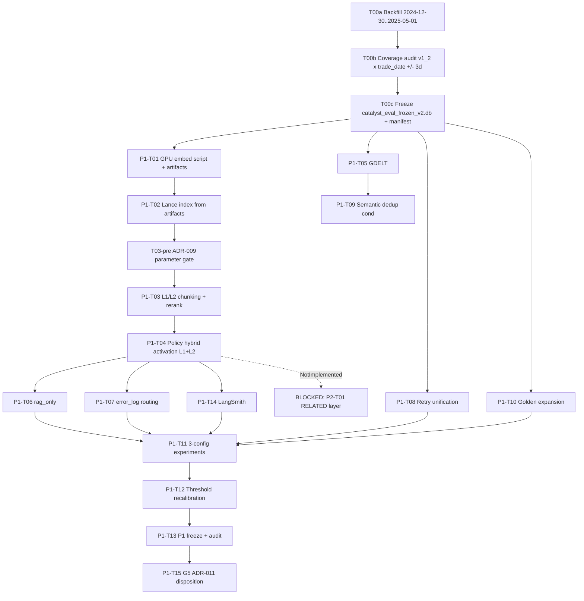

# Catalyst P1 Implementation Plan

> **For Claude / Executor:** Follow this plan and **ADR lifecycle (Policy B)** in the header: ADRs may stay **Proposed** until their **P1-Txx** definition-of-done is met, then flip **Status** with **evidence SHA**. Use **superpowers:executing-plans** (or equivalent) to implement **one P1-Txx milestone at a time** with review checkpoints. This document is executable intent; authoritative behavior remains **`docs/full-version-execution-spec.md`** and the listed ADRs.

**Goal:** Close **P1** as defined in **`docs/plans/2026-05-04-p1-p2-architecture-plan.md`**: frozen **bge-m3** embeddings → Lance Gold index → two-level chunking + gated rerank → **Layer.DIRECT/MACRO** hybrid activation (**Layer.RELATED** still **P2-blocked**) → **`rag_only`** + **`mcj_full`** + **`direct_llm`** three-way eval on **`v1_2_p1_set.jsonl`** → LangSmith-aligned traces → thresholds + freeze + **G5** disposition per **ADR-011**.

**Architecture:** Separation of **cloud GPU embedding batch** (ADR-008) from **local index build**, with **`data/catalyst_eval_frozen.db`** preserved as the immutable lineage anchor and **`data/catalyst_eval_frozen_v2.db`** introduced as the **P1 consumption artifact** through at least **P1-T04**, backed by a superset/provenance manifest. **SQLite trace** remains source of truth with **LangSmith** as optional projection keyed by **`trace_id`** (ADR-006), **immutable P0 golden rows** remain the first segment of **`v1_2_p1_set.jsonl`** (ADR-010), and **validator/downgrade semantics** stay unchanged except where **error_log** enrichment extends taxonomy without conflating **SYSTEM_ERROR** vs **INSUFFICIENT** (ADR-005 baseline).

**Tech stack anchors:** SQLite + LanceDB (**data-core**), LangGraph-agent stack (**agents**), **`catalyst_eval`** harness**, **LangChain tracing env vars** for LangSmith**, **GDELT** connector**, optional **sentence-transformers** / **cross-encoder** rerank**.

**ADR lifecycle (Policy B):** Implementation may start while ADRs are Proposed. Each ADR moves to Accepted when its gated P1-Txx passes its DoD verification; update docs/ADR/ADR-xxx.md Status in the same PR as the evidence commit (or immediate follow-up with referenced SHA). Revert to Proposed with a dated note if a later task invalidates assumptions.

---

## 1. Summary

- Produce **immutable embedding artifacts** and a **real** `data/lancedb_gold/eval_frozen/` index so **`DEFERRED_P1`** sentinel is replaced by **true `lancedb_dir_sha256`** (closes **W-15** when combined with policy activation).
- Introduce **`data/catalyst_eval_frozen_v2.db`** as the **P1 consumption artifact** without mutating **`data/catalyst_eval_frozen.db`**, and require a recorded superset/provenance manifest before vector/index work consumes it.
- Ship **L1 + L2** chunking with **`parent_asset_id`**, **1024-dim** vectors on both levels per **ADR-009**, and **gated** **`bge-reranker-v2-m3`** (or ONNX) with **`rrf_score` + conditional `rerank_score`** (**W-14**).
- Add a **`T03-pre`** gate that selects **sentence splitter**, **`max_sentences_per_asset`**, and **reranker shortlist parameters** for **ADR-009 / W-14**; it is a parameter-selection checkpoint, **not** a scope-reduction gate and **must not** demote L2 to P2.
- Activate **`retrieve()` Lance path** for **DIRECT** and **MACRO** only per **ADR-004**; **RELATED** remains **`NotImplementedError`** (**blocked-by P2-T01**).
- Add **`gdelt_news`** ingestion with **`with_retry`** and backfill macro coverage (**W-09**); unify retry policy across connectors (**design delta §4**).
- Add **`rag_only_predict`** (**W-01**) sharing Layer-1 retrieval with **`mcj_full`** (no Critic/Judge loop).
- Implement **`error_log`** routing so **`SYSTEM_ERROR`** is distinguishable from evidence refusal (**design delta §3**), consistent with validator semantics (**ADR-005**).
- Conditionally ship **semantic dedup** (**W-11**) post-overlap audit; defer if overlap &lt;5%.
- Expand golden set **`v1_2_p1_set.jsonl`** (≥30 cases, strict superset, first 10 lines byte-identical to **`v1_2_p0_set.jsonl`**) per **ADR-010**.
- Run **three-config** harness with **full-set stats + mandatory P0-subset slice + cost/latency**; emit **`data/eval_reports/p1_experiment_comparison.{md,json}`**.
- Integrate LangSmith (**W-06**) via **`LANGCHAIN_TRACING_V2`**, **`LANGCHAIN_PROJECT`**, preserving **SQLite primacy** and **`langsmith_project`** report header (**ADR-006**).
- Recalibrate **K/M** thresholds after vector retrieval; **P1 freeze** audit proves **P0 gates GREEN** on P0-subset and **Tier-A** reproducibility.
- Execute **G5 coupling audit** and update **ADR-011** with **Go (P1) / Go (P2) / No-go** — **no P2 implementation** in this track.

---

## 2. Dependency graph

**Critical path (logical):** T00a → T00b → T00c → P1-T01 → P1-T02 → T03-pre → P1-T03 → P1-T04 → P1-T06 → P1-T11 → P1-T12 → P1-T13 → P1-T15.

**Parallel (start early once `catalyst_eval_frozen_v2.db` exists):** P1-T05 (→ optional P1-T09), P1-T08, P1-T10; **P1-T14** after **P1-T04**, parallel with **P1-T06 / P1-T07**.

**Join before P1-T11:** P1-T04 + P1-T06 + P1-T10 + **P1-T14** (all must be complete per architecture plan).

**Blocked by P2 (reference only):** **P2-T01** (`Layer.RELATED`), **P2-T03/T04** (**ADR-007** budget + routing).

---

## 3. Task table

| Task ID | ADR gate / spec | Primary owner | Packages / paths (implementation locus) | Definition of Done | Verification command(s) | Risk |
|--------|-----------------|---------------|----------------------------------------|---------------------|--------------------------|------|
| T00a | Precondition for P1 data runway | HUMAN + Cursor tooling support | Ingestion/backfill scripts; **source DB lineage from `data/catalyst_eval_frozen.db`** | Backfill covers **`2024-12-30 .. 2025-05-01`** without mutating the original frozen DB; outputs staged for audit/freeze flow | Provider audit / backfill dry-run checklist; row-count deltas captured in operator notes | Backfill quality drift; provider availability |
| T00b | Coverage gate for P1 data runway | Cursor + HUMAN review | Audit scripts / notebooks; **`packages/eval/golden_set/v1_2.jsonl`** against **trade_date ± 3 days** | Coverage audit completed against candidate superset corpus; explicit gaps documented before re-freeze | Audit artifact / notebook / report referenced from future **`docs/decisions/frozen-db-v2-manifest.md`** | Hidden coverage gaps that surface late in T03/T04 |
| T00c | Frozen artifact gate | HUMAN (freeze) + Cursor (manifest schema/tooling) | **`data/catalyst_eval_frozen_v2.db`**; future **`docs/decisions/frozen-db-v2-manifest.md`** | **`data/catalyst_eval_frozen_v2.db`** exists as a separate P1 consumption artifact; superset/provenance manifest records lineage vs **`data/catalyst_eval_frozen.db`** and row-count deltas | SHA256 + table counts + superset manifest checks | Freeze inconsistencies; ambiguous provenance |
| P1-T01 | **ADR-008** | Cursor (script); **HUMAN** (GPU run + artifact handoff) | **`packages/data-core/scripts/build_embeddings_gpu.py`**; **`data/embeddings/`** outputs; SQLite read of **`data/catalyst_eval_frozen_v2.db`** through at least **P1-T04** | Artifact paths exist; canonical GPU batch is **all qualifying L1 `clean_assets` rows in `data/catalyst_eval_frozen_v2.db`**; vectors are **1024**-dim **float32** with **one vector per L1 row**; SHA256 logged; revision pin documented. **L2 sentence vectors are excluded from T01** and are produced later in **P1-T03** after **T03-pre** locks chunking parameters. | Manifest + dim check (post-handoff pytest or `python -c` one-liners added in task—not yet present); **`shasum -a 256`** on `.npy` / `.json` | Cloud cost/time; HF access; divergence if DB revision changes mid-stream |
| P1-T02 | ADR-008 (consumption) | Cursor | **`packages/data-core/scripts/build_index.py`** (`build_index.py` already lives here); `packages/data-core/catalyst_data/storage/` Lance builders; **`data/lancedb_gold/eval_frozen/`** | **Prerequisite:** **LanceDB** (client/API) **version-pinned** in **`pyproject.toml`** or lockfile **before** starting P1-T02. Valid **`gold_chunks`** consumption path against the current P1 consumption artifact; row counts / null-vector checks vs the selected embedding row set; **`lancedb_dir_sha256`** computable as real hash | Package tests for data-core + smoke query / health script from architecture plan | Schema mismatch vs ADR-009 after L2 lands; may iterate once embedding object gate resolves |
| T03-pre | **ADR-009 / W-14** parameter gate | Cursor + HUMAN review | Future **`docs/decisions/chunking-ablation-{date}.md`**; chunking prototype / audit notes | Sentence splitter, **`max_sentences_per_asset`**, and reranker shortlist/top-k parameters are selected and recorded. **This gate is parameter selection only** and **must not** demote **L2 / W-14** to P2. | Ablation note / comparison artifact reviewed before P1-T03 merge | Underspecified parameters causing churn in T03 |
| P1-T03 | **ADR-009** | Cursor | `lancedb_store.py` (**`hybrid_search`**, rerank attachment); chunking pipeline (new/adjacent modules); index schema (`parent_asset_id`, L2 vectors) | **`rrf_score`** always when hybrid returns; **`rerank_score`** when reranker loads; gated fallback tests; implementation conforms to **T03-pre** parameter selections without shrinking **L2 / W-14** scope | `pytest packages/data-core/tests/...` (paths TBD with new tests); agents tests touching `retrieve(..., rerank=...)` | Index size explosion; splitter errors on finance text |
| P1-T04 | **ADR-004**, **W-15** closure | Cursor | `packages/agents/catalyst_agents/retrieval/policy.py`; miner/router call sites | DIRECT+MACRO use Lance when **`_lancedb_available`**; SQL fallback intact; **add a new** `check_sufficiency(chunks, min_count=5, min_mean_score=0.02)` **helper** (not in codebase today; design-delta §2 is illustrative only) **and wire callers**; RELATED still **`NotImplementedError`** | Agents retrieval + graph pytest suites; comparative smoke run documenting hit-rate delta | Regression on P0-subset gates if retrieval reordering shocks metrics |
| P1-T05 | W-09 | Cursor + **HUMAN** if API keys / ops | `packages/data-core/catalyst_data/connectors/gdelt.py`; ingestion/backfill scripts; Silver → `clean_assets` | `gdelt_news` rows in eval date window; provider audit format matches existing; dedup fingerprint via **`dedup/hard.py`** | Connector tests + ingestion dry-run checklist; **`grep`** audit patterns per plan | Poor GDELT quality—may narrow scope per risk register |
| P1-T06 | W-01 | Cursor | `packages/agents/catalyst_agents/adapter.py` (**`rag_only_predict`**); harness registration | Structured **`AttributionResult`** with **`retrieved_evidence`**; **`evidence_ids`** real; wired to experiment configs | Harness pytest + smoke eval on synthetic/tiny subset | Divergence vs **`mcj_full`** retrieval if paths fork |
| P1-T07 | Design delta §3 | Cursor | **`AttributionState`** (`packages/agents/.../state.py`); **DecisionRouter**; **Critic** `error_type`; failure taxonomy doc | **`error_log` populated`; api/parse failures route **SYSTEM_ERROR** before insufficient path; regression test per taxonomy path | Router/critic/agent pytest modules; taxonomy doc checklist | Risk of collapsing distinct failures—must align **ADR-005** |
| P1-T08 | Design delta §4 | Cursor | All **`packages/data-core/catalyst_data/connectors/*.py`**; shared retry policy docs | **`with_retry`** on every connector (FRED, yfinance incl.); policy table in shared docstring; structured errors compatible with **`error_log`** | `grep -r "with_retry" packages/data-core/catalyst_data/connectors/` (full coverage assertion) | Behavioral change risk on live fetches |
| P1-T09 | W-11 (conditional) | Cursor | **`catalyst_data/dedup/semantic.py`**; pipeline hook post-`clean.py` pre-Gold | Clusters flagged; single rep per cluster in Gold; unit test duplicated pair **if** conditional met | Dedup pytest + overlap measurement script decision | Threshold calibration; unnecessary if overlap &lt;5% |
| P1-T10 | **ADR-010** | **HUMAN** (annotation) + Cursor (validation tooling) | `packages/eval/golden_set/v1_2_p1_set.jsonl` (new); pool `v1_2.jsonl` | ≥30 lines/cases; **first 10 lines byte-identical** to **`v1_2_p0_set.jsonl`**; category manifest doc | `cmp` / SHA of first N bytes; JSONL schema tests; count script | Annotation quality / schedule |
| P1-T11 | ADR-010, exec-spec §§11–12 | Cursor | **Primary extension target:** repo-root **`scripts/run_experiments.py`** — add three-config **`direct_llm` / `rag_only` / `mcj_full`**, P0-subset slicing, **`p1_experiment_comparison.{md,json}`**, reuse **`packages/eval/catalyst_eval/**`** (`compare`, metrics, schema, reports). **`packages/eval/scripts/run_frozen_eval.py`** remains the shipped **T-13b frozen-gate matrix** CLI (today defaults **`v1_2_p0_set.jsonl`**); **P1-T11 does not relocate that script** unless a later refactor merges CLIs — until then avoid duplicating report logic (**shared helpers** preferred). Update **`run_experiments.py`** usage/docs to **`v1_2*` golden files only** (repo has **`v1_2.jsonl`**, **`v1_2_p0_set.jsonl`**; **`v1.jsonl` is stale example text** there and is not the P1 golden lineage). | **`p1_experiment_comparison.{md,json}`**; Wilcoxon + categories; **P0-subset table**; cost/latency columns; LangSmith per plan | Harness integration tests; dry-run scaled experiment; manual LangSmith sanity | Stats underpowered if T10 slips below 30—document honestly |
| P1-T12 | — | Cursor | Threshold sweep tooling (reuse T-13b patterns); **`catalyst_agents.nodes.critic`** constants / config | Written calibration doc + curves; deltas vs SQL-only-era thresholds justified | Calibration pytest or notebook-backed script rerun + archived numbers | Overfitting thresholds to pass gates—forbidden per ADR-010 |
| P1-T14 | **ADR-006** | Cursor + **HUMAN** LangSmith setup | LangGraph **`graph.invoke`** wiring + env plumbing; **`TraceWriter`** unchanged as SoT | Remote traces visible; **`trace_id` join** validated; **`LANGCHAIN_TRACING_V2=false`** parity smoke; **`langsmith_project`** header in comparison reports | Manual dashboard check + automated smoke tests for env-off | Vendor SDK churn vs pinned LangChain |
| P1-T13 | Aggregate exit §1.5 | Cursor + **HUMAN** deck/defense ops | Freeze scripts; **`data/eval_reports/`**; preflight/header updates | P0 gates **GREEN** on P0-subset; **Tier-A** zero mismatches; real **`lancedb_dir_sha256`** everywhere | Frozen gate runner + reproducibility playbook | Residual regressions demand honest disclosure |
| P1-T15 | **ADR-011** | Cursor (audit grep) + **HUMAN** (strategic approval) | `packages/eval/**` import graph; `docs/decisions/` memo; **`docs/ADR/ADR-011*.md` status** | Coupling checklist complete; ADR-011 **Accepted** with **Go/Defer/No-go** + next-phase pointer | Checklist artifact in repo; optional architecture decision doc update | Scope creep into P2 package extraction |

---

## 4. HUMAN / operator runway

### 4.0 Frozen DB v2 preparation (T00a / T00b / T00c)

| Field | Content |
|-------|---------|
| **Trigger** | Before any P1 consumption path assumes improved coverage through **P1-T04**. |
| **Ideal inputs** | Immutable **`data/catalyst_eval_frozen.db`** as lineage anchor; backfill window **`2024-12-30 .. 2025-05-01`**; coverage audit against **`packages/eval/golden_set/v1_2.jsonl`** using **trade_date ± 3 days**. |
| **Ideal outputs** | Separate **`data/catalyst_eval_frozen_v2.db`** plus a future **`docs/decisions/frozen-db-v2-manifest.md`** recording source DB SHA, row-count deltas, superset assertion, backfill window, and provenance notes. |
| **Validation** | SHA256 for both DBs; table counts; explicit superset/provenance review; no mutation to **`data/catalyst_eval_frozen.db`**. |

### 4.1 Cloud GPU embedding batch (P1-T01) — ADR-008

| Field | Content |
|-------|---------|
| **Trigger** | **Start script work:** ADR-008 may remain **Proposed** while no blocking OPEN items remain. **ADR-008 → Accepted:** when **P1-T01** DoD is green (manifest + verification), update **`docs/ADR/ADR-008*.md`** in the same PR as the evidence commit or immediate follow-up with referenced SHA (Policy B). **HUMAN cloud GPU batch:** requires a lightweight **`docs/decisions/*-gpu-runtime.md`** (provider/account)—does **not** block Cursor landing **`packages/data-core/scripts/build_embeddings_gpu.py`**. |
| **Ideal inputs** | Read-only **`data/catalyst_eval_frozen_v2.db`** (or approved export of its **`clean_assets`** rows) with columns **asset_id, content_md, ticker, source_type, reference_date**; frozen **model revision pin** (HF commit hash or tarball SHA256); agreed **max wall time** and **max spend** for rental. |
| **Ideal outputs** | **`data/embeddings/bge_m3_eval_frozen_v2.npy`**: shape **(N, 1024)**, dtype **float32** for **all qualifying L1 `clean_assets` rows in `data/catalyst_eval_frozen_v2.db`**. **`data/embeddings/asset_id_index.json`**: deterministic **row index → asset_id** mapping. **`manifest.json`** (or plan appendix table): **`db_sha256`** of DB used, **`embedding_model_revision`**, **`n_vectors`**, **SHA256** per `.npy` and `.json`, with the scope recorded as **L1-only**. |
| **Human validation before handoff** | Compute and record **SHA256** for each file; confirm **N** matches manifest; optional **random row** dot-check: decode index → fetch **`content_md`** → re-embed single row on GPU to compare cosine ~1.0 (tolerance TBD). |

**Secrets on cloud:** Hugging Face token or model download auth—**never** committed; inject via environment or secret manager on the rental host.

**Artifact handoff:** Transfer `.npy`, `.json`, `manifest.json` into repo **`data/embeddings/`** (or team-agreed path); document **gitignore** policy if blobs are too large for Git (then use release artifact + hash in repo manifest only).

### 4.2 LangSmith (P1-T14) — ADR-006

| Field | Content |
|-------|---------|
| **Trigger** | After **P1-T04** (vector path real). |
| **Ideal inputs** | LangSmith account; **before P1-T14**, create a LangSmith project (e.g. slug **`catalyst-p1`**; legacy default **`catalyst`** remains acceptable if unchanged). **Org:** TBD—record where the project lives for access audits. |
| **Ideal outputs** | Local **`.env`** or shell exports only—document **names**: `LANGCHAIN_TRACING_V2`, `LANGCHAIN_API_KEY`, `LANGCHAIN_ENDPOINT` (if non-default), `LANGCHAIN_PROJECT` — **omit values** from docs/commits. |
| **How to validate** | Visible root run keyed to SQLite **`trace_id`**; flipping tracing off yields identical functional outcomes in smoke pytest. |

### 4.3 GDELT / provider keys (optional HUMAN blocker)

| Field | Content |
|-------|---------|
| **Trigger** | **P1-T05** connector testing or production backfill. |
| **Ideal inputs** | Any operator-approved API quotas; Polygon/FRED keys unaffected by GDELT if unused. |
| **Ideal outputs** | Logged ingestion window coverage stats in operator notes. |

### 4.4 Golden set curation (P1-T10) — ADR-010

| Field | Content |
|-------|---------|
| **Trigger** | Parallel with retrieval work; **must finish before P1-T11**. |
| **Ideal inputs** | Annotation rubric aligned to **`GoldenEvent`** schema + AR weights; curator time. |
| **Ideal outputs** | **`packages/eval/golden_set/v1_2_p1_set.jsonl`** conforming superset protocol; curator manifest (counts by category). |
| **Validation** | Byte identity check vs **`v1_2_p0_set.jsonl`** header segment; **`wc -l` ≥ 30**; schema tests green. |

### 4.5 Defense / freeze sign-off (P1-T13 / T15 adjacency)

| Field | Content |
|-------|---------|
| **Trigger** | After automated exit criteria satisfied. |
| **Ideal outputs** | Deck update, freeze tag/date note, stakeholder sign-off—not automatable solely in-repo. |

---

## 5. Frozen-sample checklist (from ADR-010)

- **`packages/eval/golden_set/v1_2_p0_set.jsonl`** remains **immutable** (no edits, reorders, or reweights).
- **`v1_2_p1_set.jsonl`** is a **strict superset**; **first 10 records / lines byte-identical** to P0 slice.
- **Dual reporting:** Every “P1 vs P0 improvement” narrative includes **P0-subset-only** slice **and** expanded-set slice side-by-side.
- **No sample manipulation** to force gate passes; investigate regressions instead of mutating historical rows.
- **≥30** cases target; if quality blocks count, document honestly (ADR-010 allows excluding bad candidates over faking volume).
- **Gate scripts** continue to treat P0 baselines as regression anchors.

---

## 6. Exit criteria for P1 (maps to architecture plan §1.5)

- **W-15:** Real **`lancedb_dir_sha256`** in headers and artifacts (no **`DEFERRED_P1`**).
- **W-01:** **`rag_only`** participates in three-config comparison.
- **W-06:** LangSmith traces for P1 eval runs; **`trace_id`** join to SQLite; **`langsmith_project`** emitted in reports when enabled.
- **W-14:** Reranker integrated per **ADR-009** OR documented ONNX graceful path still meets score contract semantics.
- **W-09:** **`gdelt_news`** available for Layer 2 (or waived with written scope reduction—avoid silent drop).
- **Three-config report** with statistical block + mandatory **P0-subset** table + quality/cost/latency.
- **P0 gates** remain **GREEN** on **P0-subset** under vector retrieval.
- **Tier-A reproducibility**: zero eval status mismatches on mandated rerun protocol.
- **G5 disposition** finalized in **`docs/ADR/ADR-011-*.md`** (**Accepted**) with actionable routing (**P1 extraction vs P2 vs no-go**).
- ADRs **004–006**, **008–011** (**007** stub remains P2) match implementation after review—not only drafted.

---

## 7. Open questions

1. **ADR lifecycle (resolved under Policy B, header):** Merge to **main** requires each **in-scope** ADR **Accepted** with **evidence SHA** for that track. Implementation branches may start while ADRs are **Proposed**. **Sign-off:** human confirms the PR that updates **`docs/ADR/ADR-xxx.md`** **Status** (or immediate follow-up commit referencing the passing SHA).
2. **Embedding blob VCS policy:** Git LFS vs release tarball vs hashed external URL—pick default before merging multi-GB files.
3. **Embedding object gate (resolved):** The canonical GPU batch for **P1-T01** is **all qualifying L1 `clean_assets` rows in `data/catalyst_eval_frozen_v2.db`** with **one 1024-dim vector per row**. **L2 sentence vectors are not part of T01** and are produced later in **P1-T03** after **T03-pre** locks chunking parameters.
4. **L2 row explosion:** Caps on sentences per asset to bound Lance row count—final values are selected in **T03-pre** and recorded in **`docs/decisions/chunking-ablation-{date}.md`**.
5. **Reranker in CI:** Use stub-only CI vs optional heavy model download—default: **stub in CI**, full model locally / nightly?
6. **GDELT backfill window:** Exact date bounds tied to **`v1_2_p1_set.jsonl`** extremes—coordinate with curator.
7. **LangSmith organization:** Shared org vs individual account—defines retention and access audits.
8. **Statistical multiplicity:** Corrections for repeated Wilcoxon across metrics—default: primary metric pre-registered per report front-matter?
9. **P1-T09 go/no-go overlap threshold:** Operational definition of **5%** overlap computation—specify numerator/denominator in measurement task.
10. **Experiment entrypoints (doc alignment — closed for planning):** P1 comparison work extends repo-root **`scripts/run_experiments.py`**; frozen gate / T-13b-style matrix stays **`packages/eval/scripts/run_frozen_eval.py`** until optionally merged later. Golden inputs for P1 are **`packages/eval/golden_set/v1_2*.jsonl`** only—not legacy **`v1.jsonl`** examples in docstrings.
11. **Teacher Mac extraction:** If **ADR-011 = Go(P2)**—confirm freeze still ships without blocking P1 exit (yes per plan—the decision is artifact).
12. **Cloud GPU runtime:** Provider/account decision for the ADR-008 batch—**HUMAN** records **`docs/decisions/*-gpu-runtime.md`** before running the cloud job (does **not** block Cursor from delivering the P1-T01 script).

---

## Explicit non-goals (this document and P1 track)

- **No P2 execution:** **RELATED Layer** (**P2-T01**), **LLM-graded critic sufficiency** (**P2-T02**), **budget breaker + model routing** (**P2-T03/T04**, **ADR-007** detail), **`data-core` standalone packaging** (**P2-T05**) except as **deferral targets** cited by **ADR-011**.
- **No frozen DB mutation** of **`data/catalyst_eval_frozen.db`** or retroactive edits to immutable gate JSON artifacts in planning workstreams; **`data/catalyst_eval_frozen_v2.db`** is allowed only as a **separate P1 consumption artifact** with explicit superset/provenance manifest.
- **No application code edits in this planning task session** (`packages/**` untouched by *this document write*).

---

## Appendix A — Architecture plan source-of-truth note

Some workspace views may still show **`docs/plans/2026-05-04-p1-p2-architecture-plan.md`** as a **shorter (~465-line) variant**. The **source-of-truth narrative** for P1/P2 sequencing is the **v2 architecture plan** Senior Architect version (**~608 lines**, sections through Appendix C including exec-spec phase mapping). **Sync this file** in a follow-up documentation commit if a line-count/content diff remains—not a blocker for executing this P1 plan.

---

## Appendix B — Embedding manifest schema (recommended fields)

Use a committed **`data/embeddings/manifest.json`** (or equivalently **`docs/decisions/embed-handoff-{date}.json`**) with at least:

| Key | Meaning |
|-----|---------|
| `db_path` | Logical path or artifact name hashed |
| `db_sha256` | SHA256 of frozen SQLite used |
| `embedding_model_revision` | HF revision / tarball SHA |
| `embedding_dim` | 1024 for canonical |
| `dtype` | e.g., float32 |
| `n_vectors` | Row count |
| `numpy_sha256` | Hash of **`bge_m3_eval_frozen_v2.npy`** |
| `index_sha256` | Hash of **`asset_id_index.json`** |
| `created_at_utc` | ISO timestamp |
| `operator` | Human handle |

---

## Appendix C — Future decision artifacts referenced by this plan

- **`docs/decisions/frozen-db-v2-manifest.md`** — expected to record: source and target DB SHA256s, row-count deltas by relevant table, backfill window, superset assertion, provenance notes, and any exclusions or caveats.
- **`docs/decisions/chunking-ablation-{date}.md`** — expected to record: candidate sentence splitters, **`max_sentences_per_asset`** sweep, reranker shortlist/top-k choices, comparison criteria, and the final parameter selections used for **T03-pre**.

---

## Handoff block

| Field | Value |
|-------|-------|
| **Staged paths** | _(none staged by this authoring step — stage with)_ `git add docs/plans/2026-05-06-p1-implementation-plan.md` _(when committing)_ |
| **Next human actions** | Confirm ADR Status PRs per Policy B; complete **T00a/T00b/T00c** and record **`docs/decisions/frozen-db-v2-manifest.md`** before any P1 consumption path assumes expanded coverage; add **`docs/decisions/*-gpu-runtime.md`** before **HUMAN** cloud embedding batch; provision **LangSmith** (incl. project **catalyst-p1** before P1-T14); annotate **P1-T10** golden expansion. |
| **Next Cursor coding task ID** | **P1-T01** on top of completed **T00a/T00b/T00c/T08**; build artifacts for **L1 `clean_assets` rows in `data/catalyst_eval_frozen_v2.db`**, then use **T03-pre** to lock chunking/reranker parameters before **P1-T03**. |

**Suggested commit message (human authorizes commit):** `docs: align P1 plans with repo paths and eval entrypoints`
