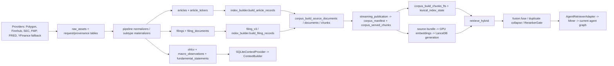

# Catalyst V1.1 Data-Core + Database Implementation Design

**Phase:** 2 — Evidence Truth Layer implementation design  
**Date:** 2026-08-17  
**Normative baseline:** `docs/plans/2026-08-16-catalyst-vnext-frozen-v1-design.md`  
**Factual baseline:** `docs/plans/2026-08-17-catalyst-v1.1-repo-reality-audit.md`  
**Inspected promoted snapshot:** `data/snapshots/catalyst_b2o_7a004accb187a17dd5661821913f5b84785af7fe448d6a92331f0bd8aea92f49.db`  
**Inspected promoted dense pointer:** `data/lancedb_gold/b6g_8ffae891b4e1/active_generation.json`

This document designs the smallest safe data-layer migration from the current repository to the Frozen V1.1 Evidence Truth Layer. It does not implement production code, alter Frozen V1.1, or define file-by-file implementation tasks.

**Dated M8 note (2026-09-18):** this TSD remains the M3 architecture authority. The later promoted production generation (`f9124704…` / `521e06c3…`, 162,434 chunks) did not retain filing/news bodies in the current served build. Do not rewrite this TSD's 2026-08-17 snapshot numbers. Rebuild and promote a general body-bearing generation via M8-A–D using these owners; do not promote the Q-011 selective candidate. Structured facts still do not enter LanceDB.

## 1. Executive Technical Assessment

The current data layer has a strong reproducible serving spine but not yet a trustworthy canonical evidence spine.

- The promoted snapshot, corpus manifest, FTS generation, source bundle, dense table, and index manifest are already identity-bound. Retrieval technology should be retained.
- The current normalized subtype tables remain the closest canonical records: `articles`, `filings`, `filing_documents`, `ohlcv`, `macro_observations`, and `fundamental_statements`.
- `corpus_build_chunks` and `corpus_served_chunks` contain richer V1.1-style metadata than the subtype tables, but they are derived representations and must not become a second canonical truth source.
- News materiality is the largest immediate blocker. Of 295,506 promoted served chunks, 41,522 are `metadata_only`; 30,945 of those are `reported_news`, while only 21 `reported_news` chunks are `active`. Current serving therefore exposes many news leads but almost no reported-news body evidence.
- SEC identity is usable at accession level, but accepted timestamps are absent from `filings`, and all 131,180 promoted filing chunks are marked `section_parse_degraded=1`. Filing-date-only eligibility is not sufficient for after-close correctness.
- Article provider, publisher, and source class are distinct and fully populated in `articles`, but canonical URLs, canonical content hashes, and dedup clusters are not owned there. `articles.dedup_cluster_id` and `representative_document_id` are unpopulated in the promoted snapshot.
- Corpus chunk identity and index identity are reproducible, but evidence identity is fragmented across `asset_id`, `article_id`, `filing_id`, `document_id`, `chunk_id`, and provider-native identifiers.

**Recommendation:** introduce one canonical asset registry keyed to existing subtype records, backfill identity/materiality/temporal/dedup fields into canonical normalized storage, then rebuild corpus, FTS5, and dense indexes from that repaired source. Do not patch promoted chunks in place.

Contract feasibility summary:

| Contract area | Classification |
|---|---|
| Common evidence identity | IMPLEMENTABLE AFTER BACKFILL |
| Provider/publisher/source class | IMPLEMENTABLE NOW for news; AFTER BACKFILL for all asset types |
| News materiality | IMPLEMENTABLE AFTER BACKFILL or REIMPORT |
| SEC accepted-time eligibility | IMPLEMENTABLE AFTER REIMPORT/BACKFILL |
| Deterministic exact dedup | IMPLEMENTABLE AFTER BACKFILL |
| Deterministic news independence | THIN IMPLEMENTATION ONLY until URL/hash/lineage coverage improves |
| Corpus/chunk provenance | IMPLEMENTABLE AFTER REBUILD |
| Hybrid retrieval/RRF/reranking | IMPLEMENTABLE NOW with metadata wiring; indexes require rebuild |
| Structured market context | THIN IMPLEMENTATION ONLY at current coverage |
| DataRuntimeIdentity | IMPLEMENTABLE NOW by consolidating existing identities |
| SEC eligibility when accepted time is unrecoverable | NEEDS NARROW CONTRACT CLARIFICATION |

## 2. Current Data Flow

| Stage | Current implementation | Identity | Default/promoted | Truth role |
|---|---|---|---|---|
| Provider fetch | `catalyst_data.connectors.*`, `providers`, `b2o`, `pipeline.ingest` | request/provider-native IDs | Offline data plane | External source |
| Raw persistence | `ingestion.raw_store`, `storage.sqlite`; `raw_assets` | `raw_assets.asset_id` | Promoted snapshot | Immutable raw archive |
| Normalization | `pipeline.finnhub_normalize`, `sec_normalize`, `fred_normalize`, `articles.upsert_article`, SEC materializers | subtype IDs | Promoted snapshot | Canonical/semi-canonical normalized data |
| News records | `articles`, `article_tickers`, `clean_assets` | `article_id`, legacy `asset_id` | Promoted snapshot | `articles` should be canonical; `clean_assets` is legacy/semi-canonical |
| SEC records | `filings`, `filing_documents` | accession-derived `filing_id`, `document_id` | Promoted snapshot | Canonical filing/document records, incomplete temporal metadata |
| Structured records | `ohlcv`, `macro_observations`, `fundamental_statements` | natural/hashed row identities | Promoted snapshot | Canonical structured facts within provider scope |
| Corpus build | `index_builder`, `corpus.filing_v3`, `news_v2`, `streaming_publication` | `document_id`, `chunk_id`, `build_id` | Promoted manifest | Derived serving representation |
| Lexical index | `retrieval.fts5`, `fts5_builder` | `chunk_id`, lexical generation | Promoted FTS5 | Derived index |
| Dense index | GPU artifact scripts, `retrieval.dense` | `chunk_id`, dense table/index manifest | Promoted LanceDB pointer | Derived index |
| Retrieval | `retrieval.hybrid`, `fusion`, `reranker` | retrieval hit `chunk_id` | Default runtime | Derived result set |
| Agent handoff | `runtime.retrieval_adapter.AgentRetrieverAdapter` | chunk/evidence IDs in state | Default runtime | Consumer; not truth owner |

## 3. Database / Store Inventory

| DB/file | Table/store | Current purpose | Canonical? | Default path? | Quality issue | V1.1 action |
|---|---|---|---|---|---|---|
| Promoted snapshot DB | `raw_assets` | Raw provider payload archive | Yes, raw truth | Identity-bound; runtime DB remains operator-configured | 23,262 rows; only 12,454 have `response_sha256`; provider/native lineage lives partly in JSON | KEEP, BACKFILL hashes where bytes exist |
| Promoted snapshot DB | `clean_assets` | Legacy cleaned Markdown assets | No; legacy normalized representation | Indirect | 24,928 rows, all non-empty and RAG eligible, zero `published_utc`, zero duplicate flags | DEPRECATE after canonical migration; DROP_LATER |
| Promoted snapshot DB | `articles` | Normalized news metadata/content summary | Yes, news subtype owner | Promoted corpus source | 164,481 rows; publisher/source class populated; no canonical hash/cluster ownership; body mostly description | SCHEMA_ADD, BACKFILL, selective REIMPORT |
| Promoted snapshot DB | `article_tickers` | Many-to-many news/ticker mapping | Yes | Promoted corpus source | Has legacy dedup fields; no issuer identity | KEEP, SCHEMA_ADD issuer mapping if needed |
| Promoted snapshot DB | `filings` | SEC filing metadata | Yes, filing subtype owner | Promoted corpus source | 5,229 rows; no accepted timestamp; no populated dedup group | SCHEMA_ADD, BACKFILL/REIMPORT |
| Promoted snapshot DB | `filing_documents` | Extracted SEC document text | Yes, document content owner | Promoted corpus source | 1,659 documents, all non-empty and `success`; coverage below filing count; no section table | KEEP, REPARSE/REIMPORT |
| Promoted snapshot DB | `ohlcv` | Daily market bars | Yes within provider scope | Used by `SQLiteContextProvider` | 15,580 rows, 40 symbols, 2024-12-30 through 2026-07-23, Polygon only | KEEP; coverage backfill as P1 |
| Promoted snapshot DB | `macro_observations` | Point-in-time macro series | Yes | Not fully wired to current production context | 92,680 rows, 12 series; `released_at` and `fetched_at` populated | KEEP, WIRE |
| Promoted snapshot DB | `fundamental_statements` | FMP statement payloads | Yes | Not wired to current production context | 375 rows, 25 tickers, 3 statement types; point-in-time `available_at` present | KEEP, WIRE; expand only if required |
| Promoted snapshot DB | `normalized_provenance` | Normalized entity to raw asset lineage | Yes, provenance edge | Available | Coverage must be audited per subtype/version | KEEP, BACKFILL |
| Promoted snapshot DB | `corpus_build_*` | Staged source/document/chunk inventory | No | Build-time and promoted publication source | 591,012 chunk rows combine active/metadata-only and pending-embedding lifecycle copies | KEEP as derived build store; REBUILD |
| Promoted snapshot DB | `corpus_served_chunks` | Current served projection | No | Active lexical relation | 295,506 rows; omits provider/publisher/URL columns; 41,522 metadata-only | MODIFY view schema after rebuild |
| Promoted snapshot DB | `corpus_manifest` | Corpus build identity | No, identity manifest | Promoted current row | Correctly binds snapshot/profile/tokenizer but embedding revision is null | KEEP, extend without duplicate manifest |
| Promoted snapshot DB | FTS5 tables | Lexical search | No | Promoted generation | Bound to 295,506 rows; reflects current bad materiality/SEC metadata | REBUILD_FTS |
| Promoted snapshot DB | `lexical_index_state` | Active lexical identity/state | No | Promoted | Good generation/digest binding | KEEP, regenerate |
| LanceDB directory | `chunks__staging__b3761f4b943542a8` | Dense vectors | No | Active pointer | Reflects old corpus semantics | REBUILD_DENSE |
| `active_generation.json` | Dense/source/corpus pointer | Cross-store runtime identity | No, operational identity | Promoted | Strong identity; table name remains operationally named staging | KEEP; treat as active dense pointer |
| `.catalyst/agent_trace.db` or runtime DB | run/trace/artifact tables | Runtime lineage and evaluation artifacts | No | Operator-dependent | Runtime DB path unresolved by Phase 1 | KEEP; bind DataRuntimeIdentity explicitly |
| Candidate/snapshot DBs | historical derivatives | Recovery/import history | No | No | Multiple multi-GB copies can be mistaken for active truth | DEPRECATE operational ambiguity; retain history; DROP_LATER only by separate retention plan |

Direct inspection did not contradict the Phase-1 architecture map. It deepened three facts that the final integrated TSD must preserve: (1) all promoted filing chunks are parse-degraded, (2) almost all reported-news served chunks are metadata-only, and (3) dedup clusters are generated only in derived corpus rows, not owned by `articles`.

## 4. CanonicalAsset Feasibility

Use a narrow `canonical_assets` registry plus existing typed subtype tables. Do not flatten all subtype payloads into one table.

| Field | Current source | Current population | Reliable? | Backfill needed? | Migration needed? | Final owner |
|---|---|---|---|---|---|---|
| `asset_id` | `raw_assets.asset_id`, `articles.article_id`, `filings.filing_id` | Present but namespace varies | Partly | Yes | Add stable canonical namespace and subtype FK | `canonical_assets` |
| `asset_type` | table/source type inference | Derivable | Yes if explicit mapping is pinned | Yes | Persist enum | `canonical_assets` |
| `issuer_id` | CIK in filings; ticker only elsewhere | Partial | No | Yes | Add issuer registry/mapping | issuer registry + `canonical_assets` |
| `tickers[]` | `article_tickers`, filing ticker, structured symbol | Good for current universe | Mostly | Normalize | Persist through association table | `canonical_asset_tickers` |
| `provider` | `articles.provider`, fundamentals provider, raw metadata | Strong for news/fundamentals | Partial across asset types | Yes | Normalize from provenance | `canonical_assets` |
| `publisher` | `articles.publisher_name` | 164,481/164,481 articles | Yes for provider-supplied value | Non-news mapping | Separate from provider | subtype + canonical projection |
| `canonical_url` | `articles.article_url`, `filings.url` | News/filing URLs populated | Not canonicalized | Yes | Normalize URL and preserve original | subtype owner |
| `source_class` | articles and corpus classifier | 164,481 articles; derived chunks populated | Reliable only under classifier version | Backfill all types | Persist canonical classification/version | `canonical_assets` |
| `source_published_at` | `articles.published_utc`, filing metadata | News populated; SEC accepted time absent | News yes; SEC no | Yes | Add source timestamp fields | subtype owner |
| `eligible_at` | corpus `available_at`, macro `released_at`, fundamentals `available_at` | Derived/populated; canonical ownership incomplete | No for SEC | Yes | Persist canonical eligibility + derivation reason | `canonical_assets` |
| `ingested_at` | raw `fetched_at`, subtype `created_at` | Present | Yes if raw lineage exists | Some | Normalize UTC | `canonical_assets` from raw provenance |
| `temporal_precision` | Not explicit | Missing | No | Yes | Add enum | `canonical_assets` |
| `content_state` | corpus `status`, extraction state, text lengths | Derived; not canonical | No | Yes | Deterministic materiality classifier | `canonical_assets` |
| `serving_status` | `is_rag_eligible`, corpus eligibility/status | Populated but conflated | No | Yes | Separate from materiality | `canonical_assets` + corpus projection |
| `title` | articles title; filing form/document metadata | News complete; filings synthesizable | Mostly | Some | Normalize | subtype owner |
| `content_ref` | filing document ID; article body/description fields | Partial | Yes if explicit | Yes | Add typed reference | `canonical_assets` |
| `content_hash` | raw response hash; corpus chunk hash | Raw partial; document hash absent | No | Yes | Compute normalized document hash | canonical normalized content owner |
| `dedup_cluster_id` | articles columns and corpus chunks | 0 article rows; 7,109 served chunks clustered | No canonical ownership | Yes | Move exact dedup result upstream | canonical dedup table/asset field |
| `parse_quality` | quality score, extraction status, `section_parse_degraded` | Fragmented | No | Yes | Add typed quality record | canonical asset/document quality |
| `subtype_metadata` | current subtype columns/payload JSON | Rich | Yes within subtype | No large flattening | Reference/version typed subtype schema | subtype tables |

## 5. Provider / Publisher / Source-Class

Current news storage correctly separates `articles.provider`, `articles.publisher_name`, and `articles.source_class`. The corpus projection does not preserve all three: `corpus_served_chunks` carries `source_class` but not provider, publisher, source type, or URL. Retrieval code can recover some metadata from build tables/index artifacts, but that is fragile and violates the frozen hit contract.

Migration:

1. Keep provider values as ingestion-system identity (`finnhub`, `polygon`, `sec`, `fmp`, `fred`).
2. Keep publisher as the original publishing organization supplied or deterministically parsed from the source record.
3. Persist `source_class` and `source_classifier_version` at canonical asset level.
4. Carry provider, publisher, canonical URL, and source class into every corpus chunk and retrieval hit.
5. Treat missing publisher as unknown; never substitute provider as publisher.
6. Preserve Frozen V1.1 source-role mapping without authority scores.

For Finnhub articles, provider and publisher are already distinguishable in populated columns. The repair is propagation and canonical ownership, not a new classification system.

## 6. Materiality / Content State

Current `searchable` semantics are broader than material evidence utility.

| Current record condition | V1.1 content state | Model/body eligible? | Final-claim capable? |
|---|---|---|---|
| Non-empty normalized article body beyond title/metadata | `FULL_TEXT` | Yes | Yes after all other gates |
| Title with no body | `TITLE_ONLY` | Only as bounded lead/existence evidence | No complex causal support |
| Description/snippet/provider metadata without article body | `METADATA_ONLY` | No document-body injection | Existence/calendar lead only |
| Empty normalized payload | `EMPTY` | No | No |
| Fetch/extract/parse terminal failure | `FAILED` | No | No |
| SEC document text with degraded section boundaries | `FULL_TEXT` plus degraded parse quality | Yes with explicit degradation | Limited; section-specific claims require valid section provenance |

Promoted served-state findings:

- 253,984 chunks are `active`; 41,522 are `metadata_only`.
- 30,945 of 30,966 served `reported_news` chunks are metadata-only; only 21 are active.
- 10,577 `analysis_opinion` chunks are metadata-only.
- All 131,180 `official_government` filing chunks are active but parse-degraded.
- All served chunks have non-empty `content_text`; therefore non-empty text is not a sufficient materiality test because metadata-only renderings contain synthetic/title/metadata text.

Required migration:

- Define a deterministic canonical content-state classifier by subtype.
- Preserve searchable leads, but exclude `METADATA_ONLY`, `EMPTY`, and `FAILED` from the model document-body payload and claim support graph.
- Add `material_capability` or equivalent derived enum to retrieval results; do not infer it from `status`.
- Retain parse degradation separately from content state.

## 7. Temporal Identity

| Source | Current time fields | Eligible-time rule | Gap |
|---|---|---|---|
| News | `published_utc`, raw fetched time, corpus `available_at` | Reliable publication time when provider supplied; otherwise conservative fetch time with reduced precision | Need canonical timezone/precision and provider validation |
| SEC filings | `filed_at` date only; no accepted timestamp in `filings` | SEC acceptance timestamp; filing date alone is insufficient | P0 reimport/backfill |
| SEC documents | extraction time only | Inherit filing accepted time | Missing parent accepted time |
| Macro | `released_at`, `fetched_at` | `released_at` | Good, subject to series release semantics |
| Fundamentals | `available_at` | Provider accepted/available timestamp | Present; validate timezone format |
| OHLCV | exchange date | Session close/open derived through exchange calendar | Good for daily facts; not documentary evidence |

Implementation rules:

- Persist `source_published_at`, `eligible_at`, `ingested_at`, `temporal_precision`, timezone/offset, and `eligible_at_reason` on canonical assets.
- For SEC, use acceptance timestamp from submissions/index metadata. An after-close filing is eligible only after acceptance, never from the exchange-local filing date alone.
- For pre-market releases, retain the real publication timestamp; session assignment is performed by `ExchangeCutoffPolicy` and exchange calendar.
- Compute prior-session windows through the exchange calendar, never calendar-day subtraction. Friday is the prior session for Monday absent a holiday; holiday closures are resolved by calendar.
- Missing time-of-day fails closed to date-level precision: it may be eligible only after the latest plausible instant consistent with the precision, unless a source-specific rule is frozen.
- Retrieval must filter `eligible_at <= cutoff_at`; post-cutoff rows remain searchable for later sessions but are excluded for the current run.

## 8. Dedup / Independence

Current coverage:

| Signal | Canonical coverage | Assessment |
|---|---:|---|
| Stable article/document ID | High | Provider-local identity, not cross-provider identity |
| Canonicalized URL | 0 explicit | URLs exist but normalization is not owned/persisted |
| Canonical document content hash | 0 explicit | Chunk hashes exist; raw response hashes cover 12,454/23,262 raw assets |
| Canonical dedup cluster | 0 article rows | Derived corpus has 7,109 clustered rows across 7,101 clusters |
| Representative document | 0 article rows | Derived served rows all carry representative ID, often self |
| Publisher identity | 164,481/164,481 articles | Useful but not sufficient for independence |
| Provider identity | 164,481/164,481 articles | Useful for lineage, not independence |
| Explicit syndication lineage | Not found as canonical field | Missing |

V1.1 algorithm, fail-closed:

1. Same canonical asset/document ID → same independence group.
2. Same normalized canonical URL → same group.
3. Same exact normalized-document content hash → same group.
4. Same canonical dedup cluster → same group.
5. Explicit known syndication lineage → same group.
6. Otherwise mark relation `UNKNOWN`; do not assert independence merely because provider or publisher differs.

Near-duplicate tooling in `catalyst_data.dedup.hard` and `dedup.cross_source` may generate candidate clusters, but only deterministic, versioned outputs with reproducible thresholds may affect V1.1 independence. Fuzzy matches that cannot be reproduced become audit hints, not hard independence facts.

Recommended Phase-3 term: `eligible_reported_news_group_count`, defined as the number of distinct deterministic independence groups represented by eligible retrieved `reported_news` assets. It does not mean that the groups semantically support the final hypothesis.

## 9. SEC Repair

Current state:

- `filings.filing_id` is accession-derived and stable; `accession_number` is populated for all 5,229 filing rows.
- `filings` has filing date but no acceptance timestamp.
- `filing_documents` contains 1,659 successful non-empty extracted documents, fewer than the filing rows.
- The promoted corpus uses `filing_v3` and contains 131,180 served SEC chunks.
- Every promoted filing chunk is `section_parse_degraded=1`.
- Section identity is derived in chunk metadata rather than owned by a canonical section table.

Decision: **REIMPORT metadata + REPARSE documents + REBUILD_CORPUS**.

- BACKFILL accession-level accepted timestamps from trustworthy SEC submissions/index metadata where raw payloads retain them.
- REIMPORT only filings whose raw archive cannot support accepted-time recovery or whose primary document is absent.
- Introduce canonical filing-section records keyed by filing/accession, document, parser version, section key, and ordinal.
- Preserve full-document text even when section parsing degrades, but mark section-specific provenance unavailable.
- Do not patch existing degraded chunk rows. Regenerate sections/chunks from repaired filing documents.

## 10. News Repair

Current state:

- `article_id` is computed from provider/native ID and is stable within provider scope.
- Provider, publisher, article URL, publication time, ticker associations, and source class are fully populated.
- `description` is populated for 159,984/164,481 articles, but description/snippet text is not equivalent to full article body.
- `clean_assets` has non-empty Markdown but no publication timestamps and is not a reliable canonical news owner.
- Canonical URL normalization, document-level content hash, syndication lineage, and canonical dedup cluster are absent.
- Promoted serving has only 21 active reported-news chunks; 30,945 reported-news chunks are metadata-only.

Migration:

- Preserve `articles` as subtype owner and add canonical URL, content-state, content reference/hash, temporal precision, parse quality, and canonical dedup fields.
- Backfill URL normalization and exact hashes for locally retained full bodies.
- Reclassify descriptions/snippets as `METADATA_ONLY` unless a provider contract proves they are complete article text.
- Selectively reimport full bodies only for the bounded benchmark/universe/time window required by V1.1; do not attempt an unbounded historical scrape.
- Keep `analysis_opinion` and `aggregated_unknown` as leads under Frozen source-role ceilings.
- Rebuild news corpus after canonical materiality and dedup are fixed.

## 11. Structured Context Inventory

| Domain | Current table/API | Point-in-time safe? | Coverage | V1.1 support | Missing data |
|---|---|---|---|---|---|
| Target prices/returns | `ohlcv` via `SQLiteContextProvider` | Yes for daily bars | 40 symbols, ~19 months | IMPLEMENTABLE NOW | Intraday/gap semantics depend on available daily open/close only |
| Benchmark | `ohlcv` supports symbols, but provider sets benchmark null | Data safe, wiring absent | Unknown benchmark rows within 40 symbols | IMPLEMENTABLE AFTER WIRING | Canonical benchmark mapping |
| Sector | Same | Data safe if sector ETF exists | Not currently supplied | THIN IMPLEMENTATION ONLY | Issuer-sector map and sector ticker coverage |
| Peers | Same | Data safe if mapped | Current provider emits empty peer map | THIN IMPLEMENTATION ONLY | Versioned peer universe/mapping |
| Volume | `ohlcv.volume` | Yes | Same 40 symbols | IMPLEMENTABLE NOW | Corporate-action/zero-volume quality checks |
| Macro | `macro_observations` | Yes when `released_at` is used | 12 series, 92,680 rows | IMPLEMENTABLE AFTER WIRING | Scheduled-event taxonomy and series selection |
| Fundamentals | `fundamental_statements` | Yes when `available_at` is enforced | 25 tickers, 375 statements | IMPLEMENTABLE AFTER WIRING | Broader issuer coverage and typed fact projection |

Data-core can supply facts and degradation flags. MoveProfile interpretation remains agents-owned.

## 12. Corpus / Chunk Identity

Required identity chain:

`canonical_asset_id` → `canonical_content_version_id` → `corpus_document_id` → `chunk_id` → FTS row and dense row keyed by the same `chunk_id` → retrieval hit carrying both `chunk_id` and `canonical_asset_id`.

Recommended deterministic formulas:

- `canonical_asset_id`: stable namespaced subtype identity, independent of corpus build.
- `canonical_content_version_id`: hash of asset ID, normalized content hash, normalizer/parser version, and materiality-relevant metadata version.
- `corpus_document_id`: derived from content version and chunk profile version.
- `chunk_id`: derived from corpus document ID, section key, ordinal, and content hash.

`ContextPack`, `EvidenceState`, `ClaimPlan`, and citations must reference `canonical_asset_id` plus `chunk_id`; they must not mint new evidence identities. Existing `document_id`/`chunk_id` builders should evolve rather than be replaced.

## 13. Retrieval / Index Serving

| Component | Decision | Reason |
|---|---|---|
| Query policy/cutoff | KEEP / WIRE | Existing deterministic policy and `ExchangeCutoffPolicy` match Frozen ownership |
| FTS5 lexical path | KEEP / REBUILD | Technology and bounded fallback are suitable; data semantics are stale |
| Dense retrieval | KEEP / REBUILD | Active-generation resolution and manifest binding are strong |
| RRF fusion | KEEP | `retrieval.fusion.fuse` is the required simple explainable fusion |
| Duplicate collapse | MODIFY | Must collapse by canonical asset/group before rerank, not only derived representative IDs |
| Reranker | KEEP / WIRE | Preserve bounded gate and degradation reporting |
| Retrieval metadata | MODIFY | Carry provider, publisher, URL, canonical asset, content state, material capability, temporal precision, parse quality, and runtime identity |
| Fallback/timeout | KEEP / WIRE | Existing degraded result paths already record reasons |

The serving relation must exclude `EMPTY`/`FAILED`, may retain `TITLE_ONLY`/`METADATA_ONLY` leads, and must provide a materiality flag that prevents those leads from becoming model body evidence.

## 14. DataRuntimeIdentity

Existing identities should be consolidated, not duplicated:

- `data_snapshot_id`: promoted certified snapshot identity.
- `corpus_manifest_id`: current `corpus_manifest.manifest_id`.
- `fts_index_version`: `lexical_generation_id` plus lexical digest/state schema.
- `dense_index_version`: `active_generation.json.index_manifest_id` plus table name.
- `embedding_model_revision`: dense index manifest model/revision, not reconstructed from defaults.
- `reranker_revision`: actual loaded reranker revision or explicit `none/degraded` value.
- `query_policy_version`: version emitted by `retrieval.query_policy`.

`RuntimeDependencyLoader` should construct one `DataRuntimeIdentity` from loaded artifacts and pass it unchanged through `ProductionHybridRetriever`, `RetrievalResultSet`, agent state, trace, and eval artifacts. `corpus_manifest` and `active_generation.json` remain the authoritative component manifests; no additional all-purpose duplicate manifest is needed.

## 15. Database Migration Plan

Dependency order:

`canonical identity` → `temporal/materiality/provenance` → `content hash and dedup` → `SEC/news repair` → `corpus rebuild` → `FTS rebuild` → `dense rebuild` → `retrieval contract validation`.

| Store | Actions |
|---|---|
| `raw_assets` | KEEP, BACKFILL response hashes and normalized request lineage where recoverable |
| `articles` / `article_tickers` | SCHEMA_ADD, BACKFILL, selective REIMPORT |
| `filings` | SCHEMA_ADD, BACKFILL accepted time, selective REIMPORT |
| `filing_documents` | KEEP, REPARSE, selective REIMPORT |
| `clean_assets` | DEPRECATE, DROP_LATER after parity audit |
| `canonical_assets` and associations | SCHEMA_ADD/MIGRATE as the common registry and projection |
| `normalized_provenance` | KEEP, BACKFILL canonical asset/content-version links |
| `ohlcv` | KEEP |
| `macro_observations` | KEEP, WIRE |
| `fundamental_statements` | KEEP, WIRE |
| `corpus_build_*` | REBUILD_CORPUS into a new build ID; retain historical builds |
| served corpus view/publication | MIGRATE to new manifest atomically |
| FTS5 tables/state | REBUILD_FTS |
| LanceDB generation | REBUILD_DENSE and atomically promote pointer |
| historical snapshot/candidate DBs | DEPRECATE operational use; retain; DROP_LATER under separate retention policy |

No historical data is deleted in this phase.

## 16. Patch-vs-Rebuild Decisions

| Derived area | Decision | Rationale |
|---|---|---|
| Corpus | REBUILD | 295,506 served rows are reproducible; patching would preserve fragmented identity and bad materiality |
| SEC chunks | REPARSE + REBUILD | 100% filing chunk parse degradation makes in-place repair unsafe |
| FTS5 | REBUILD | Cheap relative to corpus and must exactly match new served relation |
| LanceDB | REBUILD | Existing vectors encode old metadata/body semantics; clean generation promotion already exists |
| Dedup metadata | BACKFILL canonical layer, then REBUILD derived copies | Current clusters live only in derived chunks |

The dataset is large but bounded and already has streaming publication, source bundles, GPU embedding artifacts, and atomic active-generation machinery. Rebuild is simpler and more verifiable than cross-store patching.

## 17. Phase-3 CoverageSummary Input Inventory

Deterministic code can know before the Analyst runs:

- count of retrieved assets/chunks eligible under `eligible_at <= cutoff_at`;
- count by canonical content state and material capability;
- count by Frozen source role/source class;
- number of deterministic reported-news independence groups and unknown-independence assets;
- duplicate/collapsed candidate count and collapse rule used;
- metadata-only/title-only/full-text counts;
- parse-degraded and timestamp-precision counts;
- lexical/dense contribution counts, ranks, scores, RRF rank, reranker rank;
- retrieval mode requested/served, timeouts, fallbacks, and degradation reasons;
- structured target/benchmark/sector/peer/volume/macro/fundamental availability and explicit missing fields;
- exact DataRuntimeIdentity and TemporalIdentity.

Code cannot know before semantic analysis:

- whether a passage supports a causal hypothesis;
- whether an independence group corroborates the selected final cause;
- whether evidence is counter-evidence for a particular hypothesis;
- whether a claim is causally sufficient or explains move magnitude;
- whether a primary source is within the semantic scope of the claim.

## 18. P0 Critical Blockers

### P0 BLOCKER

- Canonical asset/content/chunk identity and raw provenance linkage.
- Explicit content state versus serving status; hard exclusion of metadata-only body evidence.
- SEC accepted timestamp or conservative fail-closed eligibility.
- Canonical news URL/hash/dedup ownership sufficient for deterministic grouping.
- Rebuilt corpus/FTS/dense artifacts from repaired normalized records.
- Retrieval-hit propagation of materiality, temporal, dedup, source, parse, and runtime identity.

### P1 IMPROVEMENT

- Full-body news backfill beyond the benchmark-critical universe/window.
- Benchmark/sector/peer mappings and wider structured coverage.
- Typed structured fundamental projections instead of raw statement payloads.
- Better non-degraded SEC section parsing coverage.

### OPTIONAL LATER CLEANUP

- Retire `clean_assets` and legacy build/index entrypoints after call-site and parity audits.
- Consolidate old candidate/snapshot artifacts under an explicit retention catalog.
- Add fuzzy near-duplicate hints that do not affect hard independence guarantees.

## 19. Risk Register

| Area | Risk | Mitigation | Early validation test |
|---|---|---|---|
| Canonical identity migration | MEDIUM | Stable namespaced IDs and parity tables before promotion | Every served chunk resolves to exactly one canonical asset/content version |
| News dedup | HIGH | Start with exact URL/hash/provider IDs; unknown fails closed | Hand-audit duplicate/syndicated fixtures across providers |
| Independence grouping | HIGH | Never infer independence from different provider/publisher alone | Negative fixtures remain unknown/same group as specified |
| SEC repair | HIGH | Backfill accepted metadata, preserve raw, version parser | After-close filing excluded before acceptance cutoff |
| `eligible_at` correctness | HIGH | Source-specific derivation codes and exchange-calendar tests | Weekend, holiday, premarket, after-close, post-cutoff suite |
| Corpus rebuild | MEDIUM | New build ID, reconciliation, atomic publication | Source-to-document/chunk counts and digest reproduce |
| FTS rebuild | LOW | Existing builder/state contract | FTS row count/digest equals served relation |
| Dense rebuild | MEDIUM | Existing source bundle/index manifest/pointer workflow | Every active dense row matches manifest chunk/content hash |
| Structured context | MEDIUM | Null-safe wiring and explicit coverage flags | Missing benchmark/peer data never produces inferred values |
| DataRuntimeIdentity | LOW | Build once from loaded components | Runtime/eval result identity equals actual loaded artifacts |

## 20. Final Target Data Architecture

```mermaid
flowchart LR
    RAW["provider/raw archive\nraw_assets + request/provenance"] --> NORM["normalized subtype records\narticles, filings/documents/sections, structured tables"]
    NORM --> CAN["canonical_assets + asset_tickers + content_versions"]
    CAN --> META["temporal/materiality/dedup/parse metadata"]
    META --> CORPUS["index_builder + filing_v3/news profile successor\ncorpus build/publication"]
    CORPUS --> IDX["FTS5 + LanceDB active generation"]
    IDX --> RET["query_policy -> retrieve_hybrid -> fuse -> collapse -> rerank\nRetrievalResultSet"]
    RET --> EV["AgentRetrieverAdapter -> EvidenceState"]
```

Exact ownership by arrow:

- Provider → raw: existing connectors and `ingestion.raw_store` write `raw_assets` and request/provenance tables.
- Raw → normalized: existing pipeline normalizers write typed subtype tables.
- Normalized → canonical: data-core canonical projection/migration owns common identity without duplicating subtype payloads.
- Canonical → corpus: evolved `index_builder.build_corpus_and_lexical_index`, `corpus.news_v2`, `corpus.filing_v3`, and `streaming_publication` read only canonical projections.
- Corpus → indexes: existing FTS5 builder and GPU/source-bundle/LanceDB import workflow.
- Indexes → retrieval: existing `retrieval.query_policy`, `retrieve_lexical`, `retrieve_dense`, `fusion.fuse`, duplicate collapse, and `RerankerGate`.
- Retrieval → EvidenceState: `ProductionHybridRetriever` and `AgentRetrieverAdapter` preserve canonical asset/chunk/runtime identity unchanged.

No downstream corpus/index/agent table is an alternate source of canonical provider, publisher, content, timestamp, or dedup truth.

## 21. Current → V1.1 Migration Matrix

| Current component | Current issue | Target | Classification |
|---|---|---|---|
| `raw_assets` | Partial response hashes/lineage normalization | Immutable raw archive with complete recoverable hashes | IMPLEMENTABLE AFTER BACKFILL |
| `articles` | Metadata-rich but body/materiality/dedup incomplete | News subtype under CanonicalAsset | IMPLEMENTABLE AFTER BACKFILL |
| `clean_assets` | Legacy duplicate normalized source | No canonical ownership | DEPRECATE / DROP_LATER |
| `filings` | No accepted timestamp | Filing subtype with accepted-time eligibility | IMPLEMENTABLE AFTER BACKFILL/REIMPORT |
| `filing_documents` | Incomplete filing coverage | Canonical content versions and sections | IMPLEMENTABLE AFTER REPARSE |
| `corpus_build_chunks` | Derived metadata treated as de facto truth | Reproducible projection of canonical metadata | IMPLEMENTABLE AFTER REBUILD |
| `corpus_served_chunks` | Missing source metadata; metadata-only mixed with material | Full retrieval contract projection | IMPLEMENTABLE AFTER REBUILD |
| FTS5 | Correct technology, stale semantic inventory | Rebuilt lexical generation | IMPLEMENTABLE AFTER REBUILD |
| LanceDB | Correct identity machinery, stale semantic inventory | Rebuilt dense generation | IMPLEMENTABLE AFTER REBUILD |
| `ohlcv` | Narrow production wiring | Structured target/benchmark/sector/peer facts | THIN IMPLEMENTATION ONLY |
| macro/fundamentals | Present but not production context | Deterministic point-in-time structured context | IMPLEMENTABLE AFTER WIRING |
| runtime identities | Distributed across manifests/env | One emitted DataRuntimeIdentity | IMPLEMENTABLE NOW |
| retrieval hit metadata | Incomplete canonical/materiality fields | Frozen V1.1 `RetrievalResultSet` hit contract | IMPLEMENTABLE AFTER REBUILD |

## 22. Open Implementation Questions

1. Which raw SEC payloads retain acceptance timestamps for all 5,229 filings, and what percentage requires provider reimport?
2. Which locally retained news payloads contain full bodies versus provider descriptions/snippets?
3. What exact URL normalization policy is stable across Finnhub, Polygon, redirects, tracking parameters, and SEC archive URLs?
4. Which current dedup module outputs are deterministic enough to promote to canonical clusters, and what version/threshold produced the 7,101 promoted clusters?
5. Should canonical asset identity use a new registry table or a versioned view plus subtype association tables? The contract requires one owner, not necessarily one physical payload table.
6. What conservative eligibility rule is approved for SEC rows whose accepted time cannot be recovered?
7. Which 40 OHLCV symbols are benchmark/sector/peer instruments versus target issuers, and what versioned mapping should Phase 3 consume?
8. What operator runtime DB path is authoritative at deployment time, and how is it guaranteed to match the promoted corpus/FTS/dense identities?
9. Does the current reranker load successfully in the promoted environment, and which exact revision should populate DataRuntimeIdentity?
10. What bounded news/SEC time window is sufficient for Stage-1/Stage-2 evaluation so that reimport remains targeted rather than open-ended?
