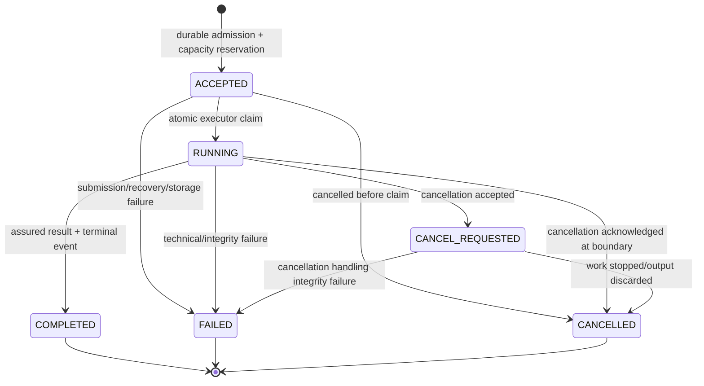

# Catalyst V1.1 Final Repository-to-V1.1 Migration TSD

**Phase:** 7 — final technical integration

**Date:** 2026-08-18

**Repository:** `/Users/yiannischen/Projects/Catalyst`

**Status:** authoritative implementation design; production implementation follows only after approval

**Normative authority:** `2026-08-16-catalyst-vnext-frozen-v1-design.md`
**Factual authority:** repository reality, with Phases 1–6 retained as supporting design evidence

## 1. Purpose and authority

This document is the single implementation-grade migration design for turning the current Catalyst repository into Frozen V1.1. It resolves the integration questions and contradictions left by Phases 1–6 without changing Frozen V1.1, inventing another architecture, or defining file-by-file implementation tasks.

Repository reality is authoritative for what exists. Frozen V1.1 is authoritative for target behavior. If an implementation detail below conflicts with a historical subsystem TSD, this document governs. The subsystem TSDs remain evidence for the decision, not competing contracts.

The final production spine is:

```text
point-in-time canonical data
→ identity-bound hybrid retrieval and structured lookup
→ Observation / MoveProfile
→ bounded ResearchTasks
→ cumulative EvidenceState
→ deterministic CoverageSummary and ContextPack
→ Evidence Analyst
→ deterministic assessment and at most one corrective action
→ ClaimPlan and deterministic ClaimValidator
→ true streaming Writer
→ structural assurance
→ durable events/artifacts
→ replayable Workbench
→ human-grounded evaluation
```

No production path contains a Planner, separate Judge, semantic LLM Validator, post-answer semantic reviewer, second corrective round, multi-agent workflow, or distributed queue.

## 2. Phase-6 Section 43 integration resolutions

| Question | Relevant phases | Repository verification | Final decision | Amendment required? |
|---|---|---|---|---|
| Exact `ACCEPTED` versus `QUEUED` lifecycle contract | Frozen, 1, 5, 6 | `create_live_run` currently returns `QUEUED`, starts a daemon thread, and has no idempotency key; `LiveRunService.create_run` writes `QUEUED` directly | `ACCEPTED` is the sole durable pre-execution state. It means validation passed, capacity was reserved, the run row and `run.accepted` event committed, and the run is eligible for executor claim. Remove `QUEUED` from new writes and public DTOs. Startup recovery handles stranded `ACCEPTED` rows. **RESOLVED — IMPLEMENTATION DECISION** | NO |
| SQLite connections and event/artifact transactions | 3, 5, 6 | the cached `RuntimeDependencyLoader` creates one `check_same_thread=False` read connection; runner, service, TraceWriter, and artifact helpers open other connections and commit independently | Use connection-per-operation. Data-core supplies read-only connection factories; app persistence repositories own short write transactions; agents never retain SQLite connections. Required event/artifact and terminal writes commit atomically. **RESOLVED — IMPLEMENTATION DECISION** | NO |
| ContextPack persistence versus reconstruction | 3, 5, 6 | current graph has no V1.1 ContextPack artifact; `node_artifacts` can store bounded JSON, but current projections store legacy state and prompt fragments | Persist the exact bounded `EvidenceAnalystContextPack` and exact normalized rendered model messages as immutable run artifacts. They are authoritative for what the Analyst saw. Reconstruction is a replay check only and may not substitute for a missing persisted pack. **RESOLVED — IMPLEMENTATION DECISION** | NO |
| Exact removal point for the legacy graph | 4, 6 | the production graph directly imports Critic, Judge, Validator, and Finalizer; eval/user-smoke reads legacy node artifacts; no independent production caller bypasses `build_attribution_graph` | Seal baseline identities in Milestone 1. Keep MCJ executable only as a baseline instrument through the Milestone-5 comparison gate. After the new semantic path passes that gate, delete MCJ production nodes/imports and retain historical artifacts, datasets, adapters, reports, and Git history—not a second executable production graph. **RESOLVED — IMPLEMENTATION DECISION** | NO |
| Single legacy API/frontend translation boundary | 1, 5, 6 | `schemas.py`, `workspace_projection.py`, frontend `api/types.ts`, and `workspace-adapter.ts` expose Judge/Validator/status fields; the default UI consumes `/workspace` after polling | `packages/app` is the only translation boundary. It maps versioned production artifacts to versioned public DTOs. The Workbench consumes only those DTOs/events. Legacy saved artifacts are read by versioned app adapters during the bounded migration window; frontend code never translates raw graph state. **RESOLVED — IMPLEMENTATION DECISION** | NO |
| Eval access to RunManifest without agents→eval dependency | 2, 3, 6 | current eval has identity-bound post-import artifacts but no complete RunManifest; agents contains no eval import and package boundary tests enforce that direction | Agents persists a versioned serialized RunManifest artifact. Eval reads it through the artifact envelope or an optional eval-side reader and stores only `run_manifest_id` plus content hash in EvalManifest. Agents never imports eval; eval never recreates production identity. **RESOLVED — IMPLEMENTATION DECISION** | NO |

All six questions are resolved. None changes Frozen package ownership, state-machine bounds, public SSE semantics, or hard gates. Frozen amendment count: **0**.

## 3. Final cross-phase decision table

| Decision | Final contract | Owner | Migration impact | Verification |
|---|---|---|---|---|
| ContextBuilder / ObservationBuilder | Reuse ContextBuilder formulas and provider seam inside one agents-owned ObservationBuilder; remove the legacy graph node/name after cutover | agents; data-core supplies PIT facts only | Evolve implementation, delete duplicate context/list state | Formula, missingness, calendar, artifact-hash tests |
| Canonical evidence identity | `CanonicalAsset.asset_id (= downstream canonical_asset_id) → canonical_content_version_id → corpus_document_id → chunk_id`; text evidence ID equals stable `chunk_id`; structured evidence ID equals stable `fact_id` | data-core | Add canonical registry/projection, reject ambiguous legacy mappings | Every served hit resolves losslessly to one canonical chain |
| EvidenceState mutability | Immutable, run-scoped, cumulative union by evidence/fact ID; Analyst judgments are separate assessment artifacts | agents | Replace mutable retrieved/reranked/graded lists | Cross-task/round union, conflict, and replay tests |
| CoverageSummary semantics | Observable availability only; use material-capable item/asset counts and known reported-news group counts | agents | Replace semantic-sounding legacy/Frozen implementation names at the internal contract boundary | Schema-negative tests prove no support/causality fields |
| ContextPack authority | Persist exact pack and rendered messages; canonical evidence remains EvidenceState, while persisted pack is authoritative model-input evidence | agents | Add artifact types, hashes, offsets, tokenizer/budget/prompt identity | Byte/hash replay and model-input equality tests |
| Runtime/eval identity | DataRuntimeIdentity is a data-core value; RunManifest references it and owns production run identity; EvalManifest references RunManifest and adds only experiment identity | data-core / agents / eval | Remove reconstructed/copy-pasted identity fields in eval | Hash/reference equality and missing/conflict fail-closed tests |
| Graph state | Thin orchestration state: run/stage, immutable artifact refs/hashes, round, attempt counters, deadline/cancel, terminal error | agents | Remove copied evidence, causes, prose, and reasoning from `AttributionState` | Serialization contains refs, not duplicated domain payloads |
| Critic/Judge/Validator | Critic becomes EvidenceAnalyst; Judge is deleted; Validator's deterministic gates move into ClaimValidator; LLM repair is deleted | agents | One semantic cutover, no dual production graphs | Import/graph/call-count tests |
| Lifecycle versus epistemic status | `RunLifecycleStatus` is separate from `AttributionStatus`; failure codes and `ResearchDecision` remain separate | app lifecycle; agents attribution | Replace mixed schemas/aliases and frontend inference | Exhaustive DTO and transition tests |
| Executor ownership | App owns process-wide run admission/executor and global resource limits. Agents ResearchExecutor owns only bounded within-run research fan-out using injected resource limits. Runner creates no executor | app / agents | Remove daemon threads and per-run graph executor | Concurrency, capacity-token, deadline, and shutdown tests |
| SQLite ownership | Connection-per-operation; data-core owns read factory, app repositories own write transactions, eval owns offline reads | data-core / app / eval | Remove cached shared retriever connection | 2–4 run WAL/lock/load tests |
| Event sequencing | Database-allocated per-run `MAX(seq)+1` under `BEGIN IMMEDIATE`; `UNIQUE(run_id, seq)` | app event repository | Replace TraceWriter in-memory counter | Concurrent append/restart tests |
| Event/artifact atomicity | Required artifacts, referencing event, and relevant lifecycle update share one transaction; any failure rolls back all | app persistence boundary; agents supplies payloads | Replace separate commits and swallowed artifact errors | Fault-injection proves no dangling durable ref |
| Cancellation | Cooperative request, boundary checks/provider abort where available, late-result discard, terminal `run.cancelled` | app control; agents observes protocol | Replace immediate `CANCELLED` mutation | Non-cancellable provider and late-completion tests |
| API DTO migration | Versioned app DTOs are the sole public boundary; no internal graph state in API | app | One bounded saved-artifact compatibility adapter | Backend/frontend contract and secret/redaction tests |
| Frontend projection | Persisted events/artifacts and app DTOs are authoritative; frontend derives display state only | app projection / Workbench display | Remove Judge/Validator projection and demo fallback from live path | Reducer replay and no-fabrication tests |
| Baseline preservation | Seal data/code/model/case/report identities; keep immutable artifacts/readers, not an executable alternate production graph | eval | Baseline-only until semantic comparison, then mainline cleanup | Reproducible report with comparability marker |
| `NO_MATERIAL` and abstention | `NO_MATERIAL_PUBLIC_CATALYST` requires all Frozen gates and is always `PARTIAL`; coverage-driven/conflict abstention uses `EVIDENCE_BACKED_CAUSAL + ABSTAIN`, which asserts no accepted cause | agents | Prevent inadequate coverage from becoming a negative finding | Cross-product ontology tests and UI wording |

## 4. Authoritative package and artifact ownership

### 4.1 Package responsibility map

| Package | Final responsibility | Explicit exclusions |
|---|---|---|
| `packages/data-core` | Raw/normalized/canonical data; source taxonomy; TemporalIdentity; materiality, eligibility, dedup and independence; structured PIT facts; corpus, FTS5, dense index, retrieval, DataRuntimeIdentity | Observation interpretation, model prompts, causal support, run lifecycle, eval truth |
| `packages/agents` | Observation/MoveProfile; research policy/execution; EvidenceState, CoverageSummary, ContextPack; Analyst/assessment/correction; claims, Writer, attribution result; RunManifest, semantic artifacts, RunAssuranceRecord | Canonical storage, HTTP/SSE, benchmark truth |
| `packages/eval` | GoldenCase, annotations, Pool/EvalManifest, metrics, ablations, reports, gates, sealed baseline readers | Production routing, runtime side effects, refusal/status policy |
| `packages/app` | HTTP admission; lifecycle; bounded run executor; persistence transaction boundary; SSE; cancellation; provider capability/credential wiring; API DTO/projection | Retrieval algorithms, causal decisions, benchmark metrics |
| `apps/workbench` | Event reduction, display-only state, navigation, interaction, reconnection | Materiality, independence, support, status, primary cause, assurance inference |

### 4.2 Singular artifact ownership

| Artifact | Owner |
|---|---|
| TemporalIdentity | `packages/data-core` |
| CanonicalAsset | `packages/data-core` |
| DataRuntimeIdentity | `packages/data-core` |
| RetrievalResultSet | `packages/data-core` |
| MoveProfile | `packages/agents` |
| ResearchTask | `packages/agents` |
| EvidenceState | `packages/agents` |
| CoverageSummary | `packages/agents` |
| EvidenceAnalystContextPack | `packages/agents` |
| AnalystDecision | `packages/agents` |
| EvidenceAssessment | `packages/agents` |
| MissingEvidence | `packages/agents` |
| CorrectiveResearchBatch | `packages/agents` |
| ClaimPlan | `packages/agents` |
| ValidatedClaimPlan | `packages/agents` |
| WriterInput | `packages/agents` |
| RunManifest | `packages/agents` |
| RunAssuranceRecord | `packages/agents` |
| RunEvent public envelope | `packages/app` |
| Runtime lifecycle | `packages/app` |
| GoldenCase | `packages/eval` |
| EvalManifest | `packages/eval` |
| Frontend projection DTOs | `packages/app`; TypeScript mirrors in `apps/workbench` are consumers |

Artifact persistence does not transfer semantic ownership to app. App owns the envelope, transaction, retention, and safe projection; the producing package owns the payload schema and meaning.

## 5. Final data and database architecture

### 5.1 One truth source per layer

```text
provider bytes / raw request lineage
→ immutable raw_assets and source archives
→ typed normalized subtype records
→ canonical_assets + content versions + subtype links
→ temporal/materiality/provenance/dedup/independence metadata
→ versioned corpus documents/chunks
→ versioned FTS5 + dense generation
→ RetrievalResultSet
→ agents-owned EvidenceState
```

Derived corpus, indexes, retrieval results, and EvidenceState never become alternate owners of provider, publisher, content, eligibility, or dedup truth.

### 5.2 Final contracts

- Canonical asset identity is a stable namespaced subtype identity. Content changes create a new content-version ID, not a new asset identity.
- The canonical serialized field remains Frozen `CanonicalAsset.asset_id`. A downstream field named `canonical_asset_id` is an exact foreign-key/reference alias to that value, never a second ID. The sole text-evidence chain is `asset_id → canonical_content_version_id → corpus_document_id → chunk_id`, and `EvidenceStateItem.evidence_id == chunk_id`. Structured evidence uses `EvidenceStateItem.evidence_id == fact_id` under a separately typed structured-fact record.
- Provider identifies ingestion; publisher identifies publication; `source_class` identifies the Frozen evidence-role ceiling. Missing publisher remains unknown.
- `content_state` is `FULL_TEXT | TITLE_ONLY | METADATA_ONLY | EMPTY | FAILED`. Serving status is separate. Metadata-only/title-only records may remain leads but never become complex causal body evidence.
- `eligible_at` is source-specific and conservative. SEC uses acceptance time; unrecoverable time-of-day fails closed rather than using filing date as an after-close shortcut.
- SEC filing identity is accession-based. Filing documents/sections are versioned by accession, document, parser version, section key, and ordinal. Parse degradation remains explicit.
- Normalized content hash is owned at the canonical content-version layer. Exact ID/URL/hash/known-syndication/dedup relations define same-group membership; ambiguous lineage is `UNKNOWN`, never independent by default.
- Chunk identity is deterministically derived from content version, corpus document/profile, section, ordinal, and content hash. FTS5 and dense rows use the same `chunk_id`.
- `DataRuntimeIdentity` contains actual loaded snapshot, corpus, lexical, dense, embedding, reranker, and query-policy versions. It is emitted once by data-core and passed unchanged.

### 5.3 Store migration and cutover

| Current store | Final role | Action | Rebuild/backfill | Cutover gate | Retirement |
|---|---|---|---|---|---|
| `raw_assets` and raw archives | Immutable provider truth and rollback source | KEEP | Backfill recoverable response hashes/lineage only | Raw hash/provenance audit | Never removed by this migration |
| `articles` / `article_tickers` | News subtype owner | EVOLVE | URL normalization, full-body state, content hash, canonical links, dedup; selective bounded reimport | Materiality, publisher/source, temporal, dedup gates | Retain |
| `filings` / `filing_documents` | Filing/document subtype owner | EVOLVE | Accepted-time backfill/reimport and document reparse | Accession/acceptance/parse/lineage gates | Retain |
| `clean_assets` | Historical legacy normalized representation | BASELINE_ONLY | Parity/read audit only | No production reader; saved artifact compatibility passes | Remove from production schema at M8; preserve historical inputs as needed |
| `canonical_assets`, content versions, associations | Common canonical registry/projection | ADD | Backfill from normalized subtypes | Every serving unit resolves exactly once | Becomes authoritative |
| `normalized_provenance` | Raw→normalized→canonical lineage | KEEP/EVOLVE | Backfill missing canonical/content links | Coverage and no-orphan audit | Retain |
| `ohlcv` | Canonical structured market facts in current provider scope | KEEP | Coverage/quality backfill | Calendar/PIT tests | Retain |
| `macro_observations` / fundamentals | Canonical PIT structured facts | KEEP/WIRE | Stable fact IDs and typed projection | `released_at`/`available_at` tests | Retain |
| `corpus_build_*` / served relation | Versioned derived serving generation | REBUILD | Full corpus rebuild from canonical projection | Identity, count, cutoff, materiality, source, SEC, dedup gates | Prior generation kept for rollback, retired at M8 |
| FTS5/state | Versioned lexical index | REBUILD | Rebuild from accepted served relation | Row/digest/arm sanity | Prior pointer retired after rollback seal |
| LanceDB/embedding generation | Versioned dense index only | REBUILD | Re-embed accepted chunks and publish new pointer | Manifest, row/hash, dense/rerank sanity | Prior directory retained through rollback window |
| `agent_runs`, `trace_events`, `node_artifacts`, assurance | Runtime metadata/events/artifacts | EVOLVE | Versioned schema migration; no semantic backfill guesswork | Compatibility reads plus new transaction/replay tests | Legacy columns removed at M8 |

All derived-store cutovers are version/pointer promotions. No promoted corpus, FTS, or dense generation is patched in place. Raw archives remain preserved.

The Frozen `benchmark-relevant SEC parse success >= 90%` gate has one predeclared interpretation. Its denominator is the unique benchmark-relevant accession set bound before the rebuild. An accession counts as successful only when its primary document has a non-empty, hash-bound successful extraction and `eligible_at` is derived either from an authoritative accepted timestamp or from the declared conservative fail-closed temporal-precision rule. `section_parse_degraded` remains a separately reported quality flag that constrains section-exact serving and citation claims; it is not substituted for, or silently folded into, the 90% primary-document gate. The report publishes numerator, denominator, excluded accessions, accepted-time recovery, fail-closed eligibility, and section-degradation counts before M3 promotion.

## 6. Deterministic pre-Analyst harness

### 6.1 Final production path

```text
StructuredObservationInputs
→ ObservationBuilder
→ MoveProfile
→ deterministic scenario classification
→ InitialResearchPolicy (≤3 ResearchTasks)
→ ResearchExecutor under one shared stage deadline
→ immutable EvidenceState
→ CoverageSummary
→ ContextPackBuilder
→ EvidenceAnalystContextPack
```

ObservationBuilder reuses current ContextBuilder formulas and evolves its provider boundary. Data-core supplies TemporalIdentity, exact session facts, mapped benchmark/sector/peer data, macro/fundamental facts, and quality flags. Agents computes returns, residuals, volume bands, one-session alignment, missingness, scenario, and the immutable MoveProfile.

Initial tasks follow Frozen precedence and `EvidenceNeed × TimeScope`, execute with bounded parallelism, and merge by task priority, task ID, within-task rank, then evidence ID. Completion timing never determines evidence order. Identity mismatch is a run failure; an unsupported optional need is a capability gap; zero hits is a valid empty task result.

EvidenceState is a cumulative union. Same chunk merges contributions, same article with multiple chunks remains multiple items, syndicated assets remain separate assets in one group, and conflicting immutable metadata fails integrity validation.

### 6.2 Deterministic code knows

- TemporalIdentity, cutoff/session validity, ticker/issuer identity, and DataRuntimeIdentity;
- observed structured values, missing/degraded fields, and scenario predicate inputs;
- task definitions, execution status, ranks/scores, fallbacks, deadlines, and latency;
- canonical asset/content/document/chunk/fact identity;
- content state, material capability, source-role ceiling, eligibility, parse quality;
- exact duplicates, known syndication groups, unknown lineage, and structural novelty;
- available eligible item/asset counts, known reported-news group counts, and capability/data gaps;
- exact packing order, excerpts, offsets, token count, omissions, hashes, and prompt/render identity.

### 6.3 Evidence Analyst judges

- semantic relevance, support, contradiction, and weak/lead-only disposition;
- plausible causal hypotheses and bounded mechanisms;
- semantic conflict and magnitude fit;
- what evidence is missing for a hypothesis;
- the conservative `READY | FOLLOW_UP | ABSTAIN` recommendation;
- a status/type recommendation that code may preserve or lower, never raise.

Neither CoverageSummary nor ContextPackBuilder claims that an available item supports a cause.

### 6.4 Final CoverageSummary fields

The implementation uses observable names:

- `eligible_item_count`, `eligible_asset_count`, `eligible_full_text_item_count`;
- `material_capable_item_count`, `material_capable_asset_count`;
- distinct asset counts for primary authority, direct primary, reported news, commentary lead, and unknown role;
- `eligible_reported_news_group_count`, `unknown_independence_asset_count`, and known duplicate/syndicated asset count;
- content-state counts, parse-degraded count, retrieval degradations;
- `data_coverage_gaps[]`, `capability_gaps[]`;
- typed `market_alignment`, `sector_alignment`, `peer_alignment`;
- nullable `scheduled_macro_present`.

### 6.5 Final ContextPackBuilder algorithm

1. Validate run, TemporalIdentity, DataRuntimeIdentity, EvidenceState, and policy hashes.
2. Inventory every unique item/fact and retain identity/safety metadata.
3. Exclude post-cutoff, `EMPTY`, and `FAILED`; exclude metadata-only body text; retain bounded title/lead metadata under its ceiling.
4. Order by research-task priority and retrieval/reranker utility.
5. Apply source-role constraints as a ceiling, not a relevance substitute.
6. Apply canonical asset, exact-document, and known-independence-group novelty.
7. Prefer temporal relevance, parse quality, and token efficiency within equal utility bands.
8. Allocate fixed observation, coverage, research-history, inventory, and payload budgets.
9. Select exact retrieved excerpts; never scan the corpus or summarize with a model.
10. Compress duplicate/syndicated news to one representative body while retaining every member in inventory.
11. Preserve distinct filing sections and admit extra chunks only within remaining budget.
12. Truncate only through registered tokenizer offsets or the declared conservative counter; record original/included counts and offsets.
13. In round two, prioritize structurally new evidence and prior Analyst-identified counter-evidence/conflicts while retaining cumulative inventory.
14. Persist provenance, included/excluded IDs, truncation records, pack hash, and rendered input identity.

No LLM is used by ContextPackBuilder.

Round-one `deterministic_conflict_signals` contain only code-computable temporal, structured-data, dedup/syndication, provider/source-metadata, and data-quality conflicts. All prior semantic conflict/counter-evidence/hypothesis/gap fields are absent or empty in round one. Round two may carry only bounded references from the persisted prior AnalystDecision/EvidenceAssessment over the cumulative canonical EvidenceState; a model-generated summary never replaces prior evidence.

## 7. ContextPack persistence authority

The authoritative record of an Analyst call is the immutable pair:

1. the exact serialized `EvidenceAnalystContextPack`, including bounded excerpt text, source offsets, all included/excluded IDs, inventory, policy/tokenizer/budget identity, and `context_pack_sha256`; and
2. the exact normalized rendered model messages sent to the provider, excluding only transport credentials/headers, plus `prompt_template_version`, `prompt_template_sha256`, and `rendered_messages_sha256`.

Both artifacts, plus the Analyst `stage.started` reference, commit successfully before the provider request is dispatched. If that publication fails, no Analyst call occurs. Every technical attempt references the same persisted pack/rendered-message hashes; the accepted `AnalystDecision` and normalized `EvidenceAssessment` bind to them as well.

Canonical Observation and EvidenceState remain the source truth from which a pack can be rebuilt. A rebuild is valid only as a replay assertion that reproduces both hashes. If the persisted model-input artifacts are missing, the run is non-replayable and cannot support eval or assurance; reconstruction does not silently become authority.

## 8. Final semantic agent path

```text
EvidenceAnalystContextPack
→ EvidenceAnalyst [LLM]
→ AnalystDecision
→ AssessmentNormalizer [deterministic]
→ EvidenceAssessment
   ├─ READY
   ├─ ABSTAIN
   └─ FOLLOW_UP
      → one CorrectiveResearchBatch
      → ResearchExecutor
      → cumulative EvidenceState
      → rebuilt CoverageSummary + ContextPack
      → EvidenceAnalyst round 2 [LLM]
      → EvidenceAssessment round 2
→ ClaimPlan [deterministic]
→ ClaimValidator [deterministic]
→ ValidatedClaimPlan
→ StreamingWriter [LLM]
→ StructuralAssurance [deterministic]
→ Finalizer [deterministic terminal wrapper]
```

Normal execution has two logical model calls. Corrective execution has three. A model role may retry once only for transport, timeout, or invalid structured schema with identical semantic input. A valid PARTIAL, ABSTAIN, weak hypothesis, or unavailable capability is never a retry reason.

No code after EvidenceAnalyst creates a causal mechanism or semantic support edge. Normalization assigns IDs, validates references, maps gaps/capabilities, sanitizes hints, computes the status ceiling, and drops/lowers invalid semantics without inventing replacements.

### 8.1 Deterministic AnalystDecision normalization

Normalization is one versioned pure contract:

1. Parse `AnalystDecision` with `extra=forbid`; accept at most three hypotheses and require every evidence reference to be unique and present in the current ContextPack inventory.
2. Reject model-supplied runtime IDs, status ceilings, recoverability, capability/health, limits, deadlines, or executable batches as schema violations. One identical-semantic-input technical retry is allowed; a second failure is `MODEL_SCHEMA_FAILURE`.
3. Assign deterministic hypothesis, statement, mechanism, gap, and relation IDs from the persisted decision hash, stable ordinal, and referenced evidence IDs.
4. Normalize evidence dispositions and links without creating support. An unknown reference is a structural failure. If the same hypothesis/evidence pair is both supporting and contradicting, drop that ambiguous relation, record the violation, and do not let it raise status.
5. Validate proposed gaps against the Frozen `EvidenceNeed`/reason mapping and the capability registry. Code owns recoverability, sanitizes query hints, computes the research fingerprint, and emits at most one production action when policy and capability allow it.
6. Compute the code-owned status ceiling: no supported hypothesis or a defeating conflict is `ABSTAIN`; unresolved conflict, commentary-only/unknown evidence, or one known reported-news group without primary evidence is at most `PARTIAL`; `SUFFICIENT` is possible only when every Frozen source, independence, coverage, and conflict gate passes, using primary/direct evidence or at least two known independent reported-news groups as applicable.
7. Set final status to the lower of the model recommendation and the code ceiling. `NO_MATERIAL_PUBLIC_CATALYST` is permitted only after required sanity research completed, coverage is non-degraded, no hypothesis has accepted support, and final status is `PARTIAL`.
8. Normalize `FOLLOW_UP` with no executable batch to `READY` capped at `PARTIAL` when a publishable supported claim remains, otherwise `ABSTAIN`. The same rule after round two closes the workflow; no third Analyst call exists.

The resulting `EvidenceAssessment` contains the exact persisted decision/pack/render hashes, normalized hypotheses and evidence relations, conflict and gap records, code-owned ceiling and final status/type, optional code-owned corrective batch, bounded reason codes, and normalization-policy version. It contains no hidden chain-of-thought or unpersisted semantic state.

## 9. Legacy semantic migration

| Current component | Disposition | Exact fate | Exit/deletion gate |
|---|---|---|---|
| ContextBuilder graph node | REMOVE | Reusable formulas/provider seam evolve into ObservationBuilder; legacy node/artifact semantics disappear | M4 foundation identity/replay passes; delete production node at M5 |
| Miner | REMOVE | Retrieval adapter is reused by ResearchExecutor; generic query mutation and list-shaped state disappear | M4 ResearchTask/EvidenceState production gate |
| Critic | BASELINE_ONLY | Rewrite first semantic boundary as EvidenceAnalyst; no Critic production alias after cutover | Seal M1 baseline; delete old node/prompt/imports after M5 comparison |
| CriticResponse | BASELINE_ONLY | Replaced by strict AnalystDecision | M5 structured-output and adapter comparison |
| CriticDecision | BASELINE_ONLY | Replaced by EvidenceAssessment and status ceiling | M5 normalization/status tests |
| DecisionRouter | EVOLVE | Same orchestration seam routes normalized `READY/FOLLOW_UP/ABSTAIN`; raw Critic-action logic removed | M5 graph transition tests |
| `expand_macro` | REMOVE | Replaced by typed MissingEvidence→CorrectiveResearchBatch using shared executor | M5 corrective schema/stop tests; no need to wait for A3 efficacy claim |
| Judge | BASELINE_ONLY | Responsibilities split among Analyst, ClaimPlan, Writer, assurance; no production model node remains | M5 claim/Writer/baseline gate |
| Validator | EVOLVE | Extract deterministic gates into ClaimValidator; remove enrichment and LLM repair | M5 claim integrity/support tests |
| Finalizer | EVOLVE | Thin wrapper persists only an assured terminal result | M5 Writer/assurance/terminal tests |
| AttributionState | EVOLVE | Thin artifact-reference orchestration state; old mutable semantic fields removed | M5 replay/state gate |
| `critic_reasoning` | REMOVE | Replace with bounded reason codes and parsed decision artifacts; retain only sealed historical artifacts | M5 redaction/projection gate |

The sealed legacy MCJ baseline may run only until the M5 comparison is approved. It is never selectable as a second production default. After deletion, reproducibility is provided by sealed code revision, environment/manifests, datasets, reports, adapters, artifacts, and Git history.

## 10. Final status ontology

| Ontology | Values | Meaning / owner |
|---|---|---|
| `AttributionStatus` | `SUFFICIENT | PARTIAL | ABSTAIN` | Epistemic result; agents |
| `AttributionType` | `EVIDENCE_BACKED_CAUSAL | NO_MATERIAL_PUBLIC_CATALYST` | Result family; agents |
| `CauseType` | `COMPANY_SPECIFIC_CATALYST | CONTINUATION | SECTOR_MOVE | MACRO_EVENT | FUNDAMENTAL_REPRICING | REPORTING_OR_ANALYST_CONTINUATION` | Causal hypothesis taxonomy; agents |
| `ResearchDecision` | `READY | FOLLOW_UP | ABSTAIN` | Workflow recommendation; agents |
| Gap reasons | Nine Frozen reason codes | Missing evidence/capability; agents |
| `RunLifecycleStatus` | `ACCEPTED | RUNNING | CANCEL_REQUESTED | COMPLETED | FAILED | CANCELLED` | Technical lifecycle; app |
| Failure code | Frozen/system typed codes | Technical/integrity failure; app projects agents classification |

The nine gap reasons are `MISSING_PRIMARY_CONFIRMATION`, `MISSING_INDEPENDENT_CORROBORATION`, `MISSING_PRIOR_SESSION_CONTEXT`, `MISSING_SECTOR_CONTEXT`, `MISSING_MACRO_CONTEXT`, `MISSING_FUNDAMENTAL_CONTEXT`, `CONFLICT_REQUIRES_RESOLUTION`, `MARKET_STRUCTURE_UNSUPPORTED`, and `LOCAL_COVERAGE_GAP`.

API run DTOs use `lifecycle_status` plus nullable `attribution_status`; they do not create a `SUCCEEDED` alias. `COMPLETED + PARTIAL` and `COMPLETED + ABSTAIN` are valid results. `FAILED` and `CANCELLED` never synthesize an AttributionStatus.

For inadequate coverage or a defeated causal hypothesis, `ABSTAIN + EVIDENCE_BACKED_CAUSAL` means the causal-attribution path produced no accepted cause. It is not a claim that a cause was found. `NO_MATERIAL_PUBLIC_CATALYST` is emitted only with completed sanity/coverage gates and status `PARTIAL`.

## 11. Final run lifecycle

`QUEUED` is removed because the single-process bounded executor needs no second durable waiting state. `ACCEPTED` already distinguishes durable admission from executor claim.



- Admission validates request/capability/runtime, reserves bounded capacity, and commits the run, RunManifest ref, and sequence-1 `run.accepted` event.
- Executor claim conditionally changes `ACCEPTED → RUNNING` with owner/task token under one transaction. Row count must equal one before agents executes.
- Cancellation of `ACCEPTED` is terminal. Cancellation of `RUNNING` persists `CANCEL_REQUESTED`, signals the control token, and reaches `CANCELLED` only when work stops or its late output is safely discarded.
- Terminal state, required terminal artifacts, and terminal event commit together. A late completion loses the conditional update and is discarded.
- Startup recovery either re-submits a valid `ACCEPTED` row under reserved capacity or fails it with a typed process-recovery code. A stranded `RUNNING` row is failed; it is never assumed safe to resume mid-graph.

The idempotency request hash is SHA-256 over canonical JSON containing ticker, session date, normalized question, provider, model ID, normalized base URL, credential-source identifier, and workflow/config versions. It excludes the idempotency key, secrets, credentials, and transport headers.

Admission uses one process-local admission lock and this exact order: validate and compute the request hash; begin an immediate transaction; resolve an existing idempotency-key mapping or equivalent active request before capacity work; non-blockingly reserve one admission slot only for a new run; insert the `ACCEPTED` run, immutable RunManifest reference, idempotency mapping, and sequence-1 `run.accepted` event; commit; submit exactly one executor task; and return `ACCEPTED` only after submission succeeds. A duplicate returns the existing run without reserving capacity or appending another event. Transaction failure rolls back and releases a newly reserved slot before `ACCEPTED` becomes visible. Submission failure first terminalizes the committed run as `FAILED` with `run.failed`, then releases the slot.

An admission slot is held for the entire capacity-bearing lifecycle `ACCEPTED | RUNNING | CANCEL_REQUESTED`. It is released exactly once only after `COMPLETED | FAILED | CANCELLED` commits, or after durable admission rolls back before `ACCEPTED` is visible. Future completion alone is not a release condition. Startup recovery reconciles slots from durable capacity-bearing rows before reopening admission, so process restart cannot create additional capacity.

## 12. Final corrective research

`MissingEvidence` is model-proposed then code-normalized. `CorrectiveResearchAction` and `CorrectiveResearchBatch` are code-owned executable artifacts.

The capability registry maps each `EvidenceNeed` to a typed local backend and health state. `MARKET_STRUCTURE` has no V1.1 backend and always produces a non-recoverable gap. Sector/news, macro text, macro series, and fundamentals remain capability-gated until their Phase-2/3 adapters are healthy.

Research fingerprints hash trusted need, time scope, lookback, ticker/source scope, sanitized hints, policy version, and window. Query hints are Unicode/whitespace normalized, bounded, and stripped of URLs, SQL/tool syntax, source selectors, ticker/date controls, and retrieval operators. Trusted runtime fields supply ticker, cutoff, filters, deadline, and limits.

Production freezes:

```text
max_corrective_rounds = 1
max_actions_per_batch = 1
```

A4 introduces its executable two-action arm only after the one-action path exists, A3 has Stage-2-or-later validation, and the predeclared human-labelled multi-gap subset meets its minimum eligible denominator. It remains eval-only and never changes the production default automatically.

Corrective execution stops on cancellation, deadline/budget exhaustion, unavailable backend, repeated fingerprint, exhausted round, invalid/empty batch, or no structurally new evidence. “No new independent evidence” means deterministic structural novelty, not semantic usefulness:

- reported news: a new eligible known independence group not already in EvidenceState;
- primary/official text: a new canonical asset/content version, with exact duplicates collapsed;
- structured context: a new stable `fact_id`;
- unknown-lineage news does not count as independent corroboration.

Round two still executes when a valid action returns empty/degraded output so the Analyst can close the bounded workflow using explicit results. It cannot request a third Analyst call.

## 13. Final claim, Writer, and assurance boundary

ClaimPlan construction may copy or mechanically normalize only Analyst-approved hypotheses, statements, mechanisms, roles, evidence links, conflict references, and fixed limitation templates. It permits at most one primary claim and cannot add causal tokens not present in approved semantics except non-causal connective/template language.

ClaimValidator checks same-run identity, temporal eligibility, materiality and source-role ceilings, canonical independence relations, citation ownership, status ceiling, required limitations, artifact hashes, and that support/counter-evidence and conflict references are exactly the typed bindings already declared by the normalized EvidenceAssessment. It may verify structural equality and enum/reference consistency for Analyst-declared magnitude-fit or time-scope fields, but it never derives semantic support, contradiction, causal relevance, magnitude fit, direction, or time scope from claim or evidence prose. It performs no keyword, NLI, embedding, or other semantic inference.

- Attribution-support failure drops/downgrades claims or status and may yield ABSTAIN.
- Integrity/system failure fails the run and never becomes ABSTAIN.

ValidatedClaimPlan is the maximum public semantic surface. WriterInput contains only final status/type, observed move, validated ordered claims, narrowly bound snippets, citation map, required limitations, and format/style constraints.

When `final_status == ABSTAIN`, the WriterInput format contract is the fixed abstention path regardless of `attribution_type`: it states that no cause was accepted, presents only bounded evidence/coverage/conflict limitations, and forbids causal-finding or `NO_MATERIAL_PUBLIC_CATALYST` language. This is a deterministic input/prompt rule, not another model role or retry.

The Writer may paraphrase, organize, and connect validated claims. It may not retrieve, invent a material fact or mechanism, alter a claim role/status/type, raise certainty, omit required limitations, or cite unbound evidence.

StructuralAssurance can guarantee:

- valid stream completion;
- allowed claim/citation marker subsets and same-run citation resolution;
- required sections/limitations;
- status/type equality with ValidatedClaimPlan;
- input/plan/evidence/runtime/output hash coherence;
- cancellation, timeout, token, and completion metadata consistency.

It cannot guarantee semantic equivalence of every paraphrase, truth beyond supplied evidence, causal correctness, or writing quality. Those remain bounded by WriterInput and measured through human-grounded eval. Assurance never rewrites output or calls a model.

## 14. DataRuntimeIdentity, RunManifest, and EvalManifest

```text
DataRuntimeIdentity (data-core value/artifact)
       ↓ referenced by ID + hash
RunManifest (agents production run identity)
       ↓ referenced by ID + hash per evaluated run
EvalManifest (eval experiment identity)
```

### DataRuntimeIdentity

Contains actual loaded snapshot, corpus, FTS, dense/index table, embedding, reranker, and query-policy identities. Data-core constructs and serializes it once.

### RunManifest

Contains run/request identity, TemporalIdentity ref, DataRuntimeIdentity ref/hash, code/workflow/policy versions, Analyst/Writer model and prompt hashes, ContextPack schema/packing/budget/tokenizer policy, hypothesis/claim schema versions, corrective bounds, deadlines/timeouts, provider capability revision, and runtime configuration. It does not duplicate an independently recomputed data identity.

### EvalManifest

Contains eval/dataset/stage/split/case identity, code/harness/model/metric identity, arm/policy settings, predeclared eligible subsets/minimum denominators, result refs, and ordered `run_manifest_id + hash` bindings. It does not carry a second authoritative copy of production runtime fields. Report views may display resolved fields but cite the source RunManifest/DataRuntimeIdentity refs.

Eval obtains RunManifest through versioned serialized artifacts or an optional eval-side adapter. Production packages never import eval, and benchmark/gold fields never enter RunManifest or production prompts.

## 15. Final runtime and executor architecture

- FastAPI/app performs validation, capability/runtime preflight, idempotency, bounded-capacity reservation, durable admission, and immediate response.
- Same idempotency key + same request hash returns the existing run; same key + different hash returns 409. Without a key, identical active requests deduplicate; a terminal historical request may create a new run.
- App owns one process-wide `ThreadPoolExecutor` with initial `max_workers = 2` and `admission_slots = 4`. `admission_slots` is pinned within `[2, 4]`, `max_workers <= admission_slots`, and the durable count of `ACCEPTED + RUNNING + CANCEL_REQUESTED` never exceeds it. There is no independent pending allowance added on top of `admission_slots`; executor-queued `ACCEPTED` runs consume the same total bound. Load tests may pin both values within those constraints without changing architecture.
- The app executor submits exactly one agents run adapter per run. The agents runner does not create another graph executor.
- Agents ResearchExecutor may fan out up to three independent tasks under the run/stage deadline, injected process resource limiter, and deterministic merge. It never owns run admission or lifecycle.
- One absolute run deadline is persisted in RunManifest. Stage/provider deadlines use the minimum remaining deadline. Timeout is technical failure.
- The initial V1.1 run deadline is `run_timeout_seconds = 60`. Narrower stage/provider limits are persisted in RunManifest and may shorten, never extend, that absolute deadline.
- Provider capability preflight requires structured Analyst output, true Writer streaming, timeout/error normalization, and declared token accounting behavior. Capability probes are preflight, not attribution model calls.
- Shutdown stops admission, cancels pending work, requests cooperative cancellation for active work, waits a bounded grace period, and leaves startup recovery to terminalize unresolved rows.
- The entire target is one local process. No Redis, Celery, Kafka, Temporal, external scheduler, or distributed worker exists.

## 16. SQLite connection ownership

The final model is **connection-per-operation**.

| Operation | Connection owner and mode |
|---|---|
| Canonical/structured/retrieval read | data-core read-only connection factory; one connection per bounded operation/task; close after result materialization |
| Admission, claim, lifecycle, idempotency | app lifecycle repository; one short read-write transaction per operation |
| Event/artifact publication | app event repository; one short read-write transaction per publication batch |
| SSE replay/read | app read-only connection per query/read loop; never shared with writer |
| Offline eval | eval-owned read-only connection, independent of production execution |

All runtime connections configure foreign keys, busy timeout, row factory, and WAL-compatible behavior consistently. No `sqlite3.Connection` crosses threads, lives inside cached `RuntimeDependencies`, or is stored in graph state. Cached objects may retain paths, factories, LanceDB handles, embedding/reranker resources, and immutable manifests—but not SQLite connections.

Load tests tune `admission_slots` within 2–4 and busy-retry limits. They never authorize more than four capacity-bearing admitted runs and do not decide connection ownership.

## 17. Final event and artifact transaction model

The evolved runtime DB contains a unique per-run sequence constraint equivalent to `UNIQUE(run_id, seq)`. Public sequence is never allocated from TraceWriter memory.

The public persisted event taxonomy is closed for V1.1: `run.accepted`, `stage.started`, `evidence.retrieved`, `evidence.reranked`, `evidence.assessed`, optional `followup.started`, `answer.started`, `answer.delta`, `answer.completed`, `assurance.completed`, and exactly one terminal `run.completed | run.failed | run.cancelled`. The `packages/app` public serializer owns the versioned envelope: `schema_version`, optional extra `event_id`, `run_id`, `sequence`, `event_type`, `emitted_at`, `stage`, bounded typed `payload`, and `artifact_refs`. Frozen public names `sequence` and `emitted_at` are normative; internal SQLite columns may remain `event_seq`/`seq` and `occurred_at` but are never exposed as competing public aliases. SSE uses `id: {run_id}:{sequence}` and `event: {event_type}`. Context packs, decisions, assessments, evidence bodies, answers, and assurance details are artifact-referenced rather than duplicated into large event payloads.

For each publication:

```text
BEGIN IMMEDIATE
read max persisted seq for run
allocate next seq (or contiguous range for a terminal batch)
insert event row(s)
insert all required artifact envelope rows referencing allocated seq(s)
apply lifecycle/result transition when applicable, conditioned on legal prior state
verify every artifact ref resolves and hashes match
COMMIT
acquire the stable process-local run condition and notify_all after commit
```

Event-first insertion inside the uncommitted transaction may satisfy the current immediate foreign key; it does not create public partial visibility. If any required artifact or lifecycle update fails, the entire transaction rolls back. Optional debug artifacts are explicitly marked optional and never become authoritative Workbench/eval inputs.

Terminal publication may allocate two contiguous events (`assurance.completed`, then terminal) in one transaction with the Assurance/Answer artifacts and lifecycle update. The terminal event is the final sequence. Late writers fail the conditional lifecycle update and publish nothing authoritative.

## 18. Race-safe SSE replay and live tail

1. Parse `Last-Event-ID` as `{run_id}:{sequence}`; reject malformed, negative, or cross-run cursors. Absence initializes cursor 0. A cursor behind the current maximum is valid and replays later rows; a cursor greater than the run's persisted maximum is `INVALID_EVENT_CURSOR`, not permission to skip the terminal event.
2. Resolve the run before streaming. Obtain the process-local condition from a run-keyed registry. Within one process the registry returns the same condition while the run is nonterminal or any stream is attached; it may remove it only after terminal publication and the last stream detaches. After restart the condition is lazily recreated.
3. While the stream is connected:
   1. Acquire that condition lock.
   2. Under the lock, open one read-only connection, begin a deferred read transaction, query committed events with internal sequence greater than the cursor in ascending order, and read lifecycle/terminal state in the same SQLite snapshot. End the transaction and close the connection before framing or waiting.
   3. If rows exist, release the lock, frame them in order, and advance the cursor only after each frame. If the batch contains the terminal event, emit it and close. Otherwise immediately continue the outer loop, reacquire the lock, and re-query before any wait; a notification that occurred while framing is therefore only an optimization and cannot strand later events.
   4. If no rows and the same snapshot shows the terminal event, release the lock and close.
   5. If no rows and the run is nonterminal, call `condition.wait(timeout=10)` while holding the lock. The wait atomically releases it. Notification, spurious wakeup, and timeout all return to the outer loop and re-query SQLite. On timeout, release the lock and emit one non-persisted heartbeat comment before re-querying.
4. EventRepository commits before acquiring the same condition and calling `notify_all()`. A writer cannot commit between the reader's empty query and wait without later acquiring the lock and waking every attached stream.
5. On reconnect or process restart, persisted replay always precedes waiting; the condition carries no authoritative event or terminal state.

SQLite persisted events are authoritative and delivery is at least once. Workbench deduplicates on `(run_id, sequence)`, detects gaps, and reconnects from its last applied sequence. Browser disconnect never cancels a run. Reconnect after terminal replays the terminal event and closes.

No WebSocket is introduced.

## 19. Writer stream persistence

```text
provider streaming delta
→ Writer adapter normalization
→ bounded coalescer
→ persisted answer.delta event
→ SSE notification
→ Workbench reducer
```

Initial configurable policy flushes at **50 ms or 2,048 UTF-8 characters**, whichever occurs first, and at provider completion. It writes no per-token rows and never slices a completed answer to simulate streaming.

Each event records stream ID, delta ordinal, exact accepted text, and cumulative accepted character/byte count. The provisional Answer artifact committed with `answer.completed` must equal the exact ordered concatenation of accepted persisted deltas. Its text hash is checked before assurance. A mismatch is `STREAM_PERSISTENCE_FAILURE` and invalidates the output.

Before the first accepted delta, one same-input technical Writer retry is allowed. After any accepted delta, provider/timeout/persistence failure has no retry; provisional output is invalidated and the run fails or cancels. Browser speed never backpressures provider callbacks; SQLite failure is bounded by a per-run buffer and then fails closed.

## 20. Final API surface and migration

### 20.1 Authoritative V1.1 surface

| Method/path | Contract |
|---|---|
| `POST /api/live-runs` | Create/admit run; optional Idempotency-Key; returns `run_id`, `ACCEPTED`, `stream_url` |
| `GET /api/live-runs/{run_id}` | Lifecycle, nullable attribution status/type, timing/failure, manifest and terminal artifact refs |
| `GET /api/live-runs/{run_id}/stream` | Persisted replay plus SSE live tail |
| `POST /api/live-runs/{run_id}/cancel` | Idempotent cooperative cancellation request/acknowledgement |
| `GET /api/live-runs/{run_id}/artifacts` | Paged artifact refs by type/stage |
| `GET /api/live-runs/{run_id}/artifacts/{artifact_id}` | One safe same-run artifact projection |
| `GET /api/live-runs/{run_id}/evidence/{evidence_id}` | Canonical evidence detail and exact backend-provided relations |
| `GET /api/live-runs/{run_id}/claims/{claim_id}` | Validated claim and bound support/counter evidence IDs |
| `GET /api/health` | Process, SQLite, executor, event store, runtime readiness |
| `GET /api/capabilities` | Provider/model streaming, structured-output, timeout, token, cancellation, readiness capabilities |

Existing session/ticker/OHLCV endpoints may remain product inputs; they are not part of the run orchestration contract.

### 20.2 Compatibility removal

- `GET /events`, `GET /workspace`, legacy `/models`, old status aliases, and polling DTOs are translated only in `packages/app` during the M6 migration window.
- New writes always use V1.1 events/artifacts and lifecycle fields.
- The default Workbench switches to SSE and versioned DTOs at M6.
- Compatibility polling/workspace endpoints and saved-artifact translation are removed at M8 after caller audit and replay/frontend gates. Historical artifacts remain readable through offline/versioned tooling, not the live public DTO.
- `cancel-all` is not part of the normal public API. Retry, if retained, creates a newly admitted linked run and never reopens a terminal row.

## 21. Final Workbench data architecture

```text
REST durable admission
→ SSE replay/live reducer
→ persisted event/artifact references
→ on-demand app projections
→ Workbench display state
```

| Panel/data | Classification | Authority |
|---|---|---|
| Session and observed move / MoveProfile availability | PRIMARY | Session DTO + MoveProfile projection |
| Run progress, cancel, lifecycle/result | PRIMARY | Run events/DTO |
| Candidate, selected, lead, rejected evidence | PRIMARY | retrieval/assessment artifacts and evidence DTO |
| Streamed answer, status/type, limitations, citations | PRIMARY | Answer, ValidatedClaimPlan, Assurance |
| Claim→evidence navigation | PRIMARY | ValidatedClaimPlan IDs only |
| Research tasks and per-task degradation | DEVELOPER_EXPANDABLE | ResearchTask/result artifacts |
| Rerank changes and duplicate collapse | DEVELOPER_EXPANDABLE | Retrieval artifacts/events |
| Coverage/data/capability gaps and corrective batch | DEVELOPER_EXPANDABLE | CoverageSummary/EvidenceAssessment/batch |
| Runtime/data/model/prompt identity, latency/tokens/cost | DEVELOPER_EXPANDABLE | RunManifest/assurance |
| Critic/Judge/Validator product panels | REMOVE / NOT USER-FACING | Legacy only |
| Raw AttributionState, `critic_reasoning`, raw provider response | REMOVE / NOT USER-FACING | Never a normal UI source |
| Demo/mock fallback on live failure | REMOVE / NOT USER-FACING | Explicit dev/test mode only |

The frontend may derive tab, expansion, connection, cursor, loading, and provisional-display state. It must not infer materiality, independence, support, status, primary cause, causal role, claim links, or assurance from raw values or event order.

`packages/app` is the sole live public DTO/projection boundary. Workbench consumes only versioned public DTOs, public RunEvents, and safe app projections for artifacts/evidence/claims; it never consumes raw graph state, provider objects, or internal agents artifacts directly. Historical artifact compatibility is a bounded app-side reader/adapter. For an `ABSTAIN` result, Workbench renders “no accepted cause” plus supplied gaps/limitations and does not display `attribution_type` as a causal or no-material badge; type is user-visible only for `PARTIAL` or `SUFFICIENT` results.

## 22. Final evaluation architecture

### 22.1 Contracts and stages

- `GoldenCase` contains request/cutoff, human oracle status/type/causes, evidence judgments/roles/groups, expected primary evidence, conflicts/refusal, expected research behavior, provenance, notes, and dataset lineage.
- `EvalManifest` binds dataset/split/case order and hash, production RunManifest refs, pool/arm/policy/model/metric identity, eligible subsets/minimum denominators, and results.
- Stage 1 is exactly 12 human-reviewed development cases for contract development and regression signals.
- Stage 2 is approximately 40–60 stratified human-reviewed validation cases and is the minimum basis for A3 retention and A4 promotion conclusions.
- Stage 3 is 15–20 untouched holdout cases required for external quantitative claims.

Human labels are primary truth for relevance, independence relations, cause, status, answerability, conflict, and expected research behavior. LLM judges may diagnose language or semantic similarity but never define ground truth or hard gates.

Every metric reports numerator, denominator, eligible count, excluded/non-scorable count, case IDs/manifest, and uncertainty appropriate to the small sample. T4 and user-smoke remain identity-bound regression/smoke suites, not evidence of attribution quality.

### 22.2 Metric families

| Family | Required measurements |
|---|---|
| Retrieval | Recall@K, MRR, nDCG@K, primary-source hit, duplicate-adjusted precision, independent-group recall, diversity, reranker contribution, cutoff/ticker violations, latency/degradation |
| Attribution | citation resolution/correctness, evidence precision, causal relevance, material coverage, unsupported claims, status matrix, false SUFFICIENT, refusal/no-material/conflict correctness, latency/tokens/cost |
| Trajectory | corrective trigger precision/recall, gap/action match, stop correctness, useful/unnecessary correction, zero-new-structure, paired attribution delta, latency/cost |

Retrieval over a pinned human-reviewed independence relation and evaluation of the grouping algorithm itself are separate metrics; runtime grouping cannot be its own oracle.

## 23. Final A1–A5 experiment seams

One production runner exposes versioned configuration seams. No experiment creates a second production graph.

| ID | Single changed seam | Fixed controls | Production implication |
|---|---|---|---|
| A1 ContextPack | legacy/raw pack versus deterministic ContextPack policy | case, runtime, retrieved pool, models, prompt intent, budget, evaluator | ContextPack identity/safety invariants stay; optional packing policy may simplify only through change control |
| A2 hypothesis competition | one candidate versus at most three | pack, evidence, models, prompt, budget, evaluator | Bounded competition requires Stage-2 evidence to remain/promote as optional policy |
| A3 correction | zero rounds versus one action | initial tasks/evidence, models, budget, evaluator, deadline | Production one-action path is reconsidered only through explicit amendment if Stage-2 evidence is negative |
| A4 action count | one versus up to two parallel actions | multi-gap cases, deadline, merge, models, evaluator | Eval-only; two actions require explicit Stage-2+ promotion |
| A5 observation | limited context versus MoveProfile-aware policy | case, retrieval pool, models, budget, evaluator | Missing structured fields remain explicit; no invented proxies |

Negative results are preserved and reported. Optional complexity that does not justify itself may be removed through the appropriate evidence/change-control process. Temporal eligibility, canonical identity, materiality, deterministic independence, runtime identity, and citation lineage are correctness invariants, not ablatable production features.

## 24. Consolidated test architecture

| Layer | Core scope | Tier |
|---|---|---|
| Unit | IDs/hashes, source/materiality/temporal rules, MoveProfile formulas, task policy, EvidenceState union, coverage, packing, normalization, status ceiling, correction, claims, assurance, reducer | FAST |
| Contract | Cross-package serialized schemas, package boundaries, lifecycle/status ontology, event/artifact envelopes, RunManifest/EvalManifest refs, hidden-gold isolation | FAST |
| Integration | Rebuilt retrieval fixtures, one full fake-provider graph, app admission/executor, SQLite transaction/races, claim/evidence APIs, frontend components | MEDIUM |
| Replay | Pack/render hash reproduction, persisted run replay, SSE reconnect/dedup, final answer from deltas, saved-artifact adapter | MEDIUM |
| Provider | structured output, real streaming, usage, timeouts, cancellation/late discard, capability probe | EXPENSIVE/ON-DEMAND |
| Frontend | pure reducer, replay/live equivalence, refresh/reconnect, provisional invalidation, status UX, no semantic fabrication | FAST/MEDIUM |
| Eval | GoldenCase/manifest validation, Stage 1–3 metrics, A1–A5, four-arm, T4/user-smoke, leakage scans | EXPENSIVE/ON-DEMAND |

The FAST suite runs deterministic code without models, GPU, or production data. MEDIUM uses SQLite and bounded fixtures/fake providers. EXPENSIVE runs real provider, embedding/reranker/GPU, promoted-data load, Stage-1+, and user-smoke workflows. Fixture-testable means contract-ready, not production-ready.

## 25. Final technical-debt retirement

| Legacy subsystem | Replacement | Authoritative gate | Deletion milestone |
|---|---|---|---|
| MCJ semantic graph and prompts | Analyst→assessment→claims→Writer path | M5 call-count, lineage, baseline, status, assurance gates | M5 |
| Legacy context/miner list state | Observation/ResearchTask/EvidenceState/ContextPack | M4 identity/hash/replay gates | M5 |
| `critic_reasoning`/raw semantic response projection | parsed artifacts and bounded reason codes | redaction and app/frontend projection tests | M5/M6 |
| Validator LLM repair/enrichment | deterministic ClaimValidator | claim support/integrity regression suite | M5 |
| Finalizer ranking/status inference | thin assured terminal wrapper | Writer/assurance/result tests | M5 |
| Daemon thread and per-run executor | app bounded executor | capacity, cancellation, timeout, shutdown | M6 |
| Non-atomic `run_next` | conditional app claim | competing-claim race test | M6 |
| Cached shared SQLite read connection | per-operation factory | 2–4 concurrent run/load gate | M6 |
| In-memory event sequence/separate commits | app EventRepository transaction | concurrent append/fault/restart tests | M6 |
| Polling/default `/workspace` path | SSE reducer and versioned projections | replay/reconnect/frontend integration | M6 default; remove M8 |
| Legacy status/event/frontend DTOs | separated versioned DTOs | all tracked callers/saved reads translated | M8 |
| Stale corpus/FTS/dense pointer | repaired generation | M3 data/retrieval/rollback gates | M8 |
| Broken derived SEC/news rows | repaired canonical generation | M3 parse/materiality audit | M3 pointer cutover; purge only M8 |
| Old eval schemas/harness | sealed baseline artifacts/readers | M7 reproducible comparison | M8 executable cleanup |
| Temporary backfill/rebuild tools | archived command/manifests/repeatability reports | accepted generation can be reproduced | M8 |

No deprecated production path remains indefinitely. Historical artifacts/data are preserved without preserving obsolete execution semantics.

## 26. Final dependency DAG

| Upstream → downstream | Class | Fixture-testable before data cutover? | Production-ready condition |
|---|---|---:|---|
| Raw preservation → canonical repair | HARD | No | Raw/provenance audit passes |
| Canonical identity/materiality/temporal/dedup → corpus/FTS/dense | HARD | Schemas only | Repaired versioned generation accepted |
| Structured facts → MoveProfile | HARD for available fields | Yes | Certified mappings/coverage; unknown remains explicit |
| Rebuilt retrieval → production EvidenceState | HARD | Yes | Complete hit metadata and per-operation connections |
| EvidenceState + MoveProfile → CoverageSummary → ContextPack | HARD | Yes | Production identity/hash gates |
| ContextPack → Analyst → assessment | HARD | Yes | Provider structured-output and pack replay gates |
| Assessment → correction/ClaimPlan → validation | HARD | Yes | Capabilities and lineage gates |
| ValidatedClaimPlan → Writer → assurance | HARD | Yes | Real streaming/provider and structural gates |
| Events/artifacts → SSE → Workbench | HARD | Yes with fake producer | Atomic persistence/replay/live frontend gates |
| GoldenCase + EvalManifest → Stage-1 interpretation | HARD | Yes with hidden fixtures | Human labels and RunManifest refs complete |
| A1/A2/A5 plumbing | SOFT | Yes | Production data/models for meaningful results |
| A3/A4 conclusions | SOFT | Yes for mechanics | Introduce and run A4 only after Stage-2+ A3 validation; A4 remains eval-only until an explicit Stage-2+ A4 promotion report |
| Typed contracts, event store, reducer, eval metrics | PARALLELIZABLE | Yes | Integration gates at owning milestone |

Work that can proceed before M3 includes typed schemas, MoveProfile formulas, task/merge policy, EvidenceState, CoverageSummary, ContextPack packing/replay, Analyst/claim pure logic, app event/executor/SSE fixtures, frontend reducer, GoldenCase/EvalManifest loaders, and metric implementations. None may make production-quality claims before the repaired runtime identity exists.

## 27. Final migration milestones

The Phase-6 eight milestones remain dependency-valid and are the required top-level structure for later implementation writing plans.

### Milestone 1 — Baseline sealed

| Field | Contract |
|---|---|
| WHAT BECOMES TRUE | Current MCJ, T4/user-smoke, data/index/model/code/case identities and comparison outputs are reproducible |
| DEPENDENCIES | Current artifacts and repository revision |
| MAJOR WORK | Seal hashes/manifests/reports, baseline reader/adapter inputs, comparability markers |
| EXIT GATE | Repeatable baseline report with no hidden fixture/gold leakage |
| LEGACY REMOVED | None |
| ROLLBACK | Restore sealed pointers/config/revision |
| PARALLEL WORK | M2 schemas, fake event/reducer and hidden-gold fixtures |

### Milestone 2 — Contract spine ready

| Field | Contract |
|---|---|
| WHAT BECOMES TRUE | Singular typed V1.1 data, agents, runtime, eval, event, artifact, and DTO contracts pass offline tests |
| DEPENDENCIES | Frozen V1.1 and this TSD |
| MAJOR WORK | Schema/ontology/ref/hash contracts and cross-package fixtures |
| EXIT GATE | FAST cross-package/hidden-gold suite green; no duplicated owner |
| LEGACY REMOVED | None |
| ROLLBACK | Revert contract/config revision; baseline untouched |
| PARALLEL WORK | Data repair, app persistence, frontend reducer, metric plumbing |

### Milestone 3 — Repaired data generation accepted

| Field | Contract |
|---|---|
| WHAT BECOMES TRUE | A versioned canonical DB/corpus/FTS/dense generation is trustworthy and promotable |
| DEPENDENCIES | M1 raw archive and M2 identity contracts |
| MAJOR WORK | SEC/news/temporal/materiality/dedup repair; rebuild and manifest publication |
| EXIT GATE | Identity, provenance, cutoff, materiality, source, the §5.3 benchmark-accession SEC parse metric and separate section-degradation report, dedup, count, FTS/dense/four-arm gates |
| LEGACY REMOVED | Broken/stale generation leaves active serving only; retained for rollback |
| ROLLBACK | Atomically restore prior generation pointers |
| PARALLEL WORK | All fixture-based agents/app/eval/frontend work |

### Milestone 4 — Foundation path authoritative

| Field | Contract |
|---|---|
| WHAT BECOMES TRUE | Observation/MoveProfile, bounded research, EvidenceState, CoverageSummary, and persisted ContextPack are the only Analyst inputs |
| DEPENDENCIES | M2; M3 for production binding |
| MAJOR WORK | Wire repaired retrieval/structured data, deterministic merge/packing, exact persistence/replay |
| EXIT GATE | Production identity, state union, pack/render hash, budget, and provenance tests |
| LEGACY REMOVED | Context/miner mutable state becomes baseline-only |
| ROLLBACK | Select sealed baseline revision/config, never mixed state |
| PARALLEL WORK | Analyst/claim logic; app event/SSE against fake producer |

### Milestone 5 — Semantic path cut over

| Field | Contract |
|---|---|
| WHAT BECOMES TRUE | One Analyst/assessment/correction/claim/Writer/assurance path produces valid results in 2/3 logical calls |
| DEPENDENCIES | M4 production ContextPack and M2 semantic contracts |
| MAJOR WORK | Structured Analyst, normalization, correction, claims, Writer, assurance, thin state/finalizer |
| EXIT GATE | Schema/retry, status, lineage, citation, Writer, assurance, call-count and sealed-baseline comparison |
| LEGACY REMOVED | Critic/Judge/LLM Validator/expand_macro/legacy Finalizer and MCJ production imports |
| ROLLBACK | Revert to sealed baseline revision only; do not dual-run production |
| PARALLEL WORK | App runtime/frontend against stable result artifacts |

### Milestone 6 — Runtime/event/Workbench cut over

| Field | Contract |
|---|---|
| WHAT BECOMES TRUE | Durable ACCEPTED admission, bounded executor, atomic claim/events/artifacts, cancellation, SSE and authoritative Workbench form one path |
| DEPENDENCIES | M2 event/DTO contracts; M5 Writer/result artifacts for final integration |
| MAJOR WORK | Lifecycle/idempotency, connection factories, event repository, replay/live tail, delta persistence, APIs, frontend reducer/projection |
| EXIT GATE | `admission_slots` 2–4 with `ACCEPTED + RUNNING + CANCEL_REQUESTED <= admission_slots`, transaction fault, replay race, reconnect, cancel/late discard, final-delta equality, frontend no-fabrication |
| LEGACY REMOVED | Daemon/per-run executor, `run_next`, shared SQLite connection, default polling, old live projection |
| ROLLBACK | Revert versioned app/frontend build and runtime schema reader; do not mix event schemas |
| PARALLEL WORK | Performance observation, Stage-1 annotation completion |

### Milestone 7 — Stage-1 operational

| Field | Contract |
|---|---|
| WHAT BECOMES TRUE | Twelve hidden human-reviewed cases run through one manifest-bound V1.1 path with interpretable metrics |
| DEPENDENCIES | M3–M6 plus GoldenCase/EvalManifest |
| MAJOR WORK | Stage-1 A1/A2/A3/A5 development signals, A4 schema and eligibility-manifest readiness only, T4/user-smoke, and migration regression |
| EXIT GATE | Hard gates, all denominators/eligible counts, no leakage, reproducible reports/artifacts |
| LEGACY REMOVED | Legacy eval becomes sealed baseline reader only |
| ROLLBACK | Re-run sealed prior generation/path by manifests; label non-comparable identities |
| PARALLEL WORK | Stage-2 annotation and Stage-3 holdout preparation |

### Milestone 8 — Cleanup and release candidate

| Field | Contract |
|---|---|
| WHAT BECOMES TRUE | One understandable default path remains and Stage-2 readiness is evidenced |
| DEPENDENCIES | M7 plus every named deletion gate |
| MAJOR WORK | Remove shims/legacy executable paths/stale pointers/temp tools; finalize CI tiers, rollback and retention docs |
| EXIT GATE | Repository-wide FAST/MEDIUM, selected EXPENSIVE gates, clean imports, diff audit, reproducible Stage-1 report |
| LEGACY REMOVED | All remaining items in §25; historical raw/data/reports remain |
| ROLLBACK | Restore versioned DB/index/app revision or revert focused cleanup commits |
| PARALLEL WORK | Non-critical UI/performance polish and Stage-2 case work |

## 28. Critical path

The shortest credible route is:

```text
seal baseline
→ canonical temporal/materiality/identity repair
→ versioned corpus/FTS/dense cutover
→ production EvidenceState + MoveProfile + persisted ContextPack
→ EvidenceAnalyst + assessment + claims
→ real Writer streaming + assurance
→ atomic events/artifacts + SSE replay
→ Workbench reducer/projection
→ 12-case Stage-1 EvalManifest report
```

| Class | Work |
|---|---|
| CRITICAL | M1 baseline; canonical/SEC/news/dedup repair; rebuilt retrieval; foundation artifacts; Analyst/claims/Writer; event/artifact transactions; SSE/replay; primary Workbench; GoldenCase/EvalManifest Stage 1 |
| PARALLEL | Typed fixtures; pure normalization/claims; event store/fake producer; frontend reducer; metrics; provider adapter tests; Stage-1 annotation |
| NON-BLOCKING | Rich developer panels, additional artifact browsing, post-correctness performance tuning, report presentation polish |
| DEFERRED | §30 do-not-build list, broad provider expansion, cloud/deployment scale, Stage-2/3 execution after Stage-1 readiness |

## 29. Final material risk register

| Risk | Probability | Impact | Early signal | Mitigation | Blocking milestone |
|---|---|---|---|---|---|
| Canonical migration loses identity/provenance | Medium | High | orphan/multi-mapped serving units, hash/count drift | stable namespace, parity tables, versioned rebuild | M3 |
| SEC accepted time/parse repair incomplete | High | High | after-close leak or benchmark parse < gate | raw rederive/reimport, fail-closed eligibility, versioned parser | M3 |
| News materiality remains mostly metadata-only | High | High | full-text reported-news hit rate near zero | bounded selective reimport, strict content-state gate | M3/M7 |
| Dedup/independence relation is wrong | Medium | High | human relation fixture disagrees | exact fail-closed grouping, separate algorithm eval | M3/M7 |
| Market/sector/peer structured coverage thin | Medium | Medium | unknown MoveProfile fields on eligible cases | explicit unknowns, mapped PIT backfill, A5 coverage report | M3/M7 |
| ContextPack drops/misrepresents evidence | Medium | High | replay/hash/citation/inventory mismatch | exact persisted pack/rendered input, budget/inventory tests | M4 |
| Analyst structured output drifts | Medium | High | schema retry/reference violation rate | strict schema, identical-input retry, provider capability gate | M5 |
| Semantic graph cutover regresses status/causes | Medium | High | paired baseline hard-gate or ontology regression | sealed baseline, one cutover, table-driven normalization | M5 |
| Corrective research repeats or adds no structure | Medium | High | duplicate fingerprints/high zero-new rate | one action/round, capability registry, novelty stop | M5/M7 |
| ClaimValidator/Writer publishes unsupported content | Medium | High | unknown citation, lineage or marker failure | maximum public plan, deterministic validation/assurance | M5 |
| SQLite contention/connection misuse | Medium | High | locked errors, cross-thread errors, latency spikes | per-operation connections, WAL, short writes, 2–4 load test | M6 |
| Event sequence/atomicity/replay race fails | Medium | High | duplicate/gap/dangling ref/lost wakeup | `BEGIN IMMEDIATE`, same transaction, condition protocol | M6 |
| Cancellation allows late success | Medium | High | events/artifacts after cancelled terminal | conditional terminal transition and late discard | M6 |
| Frontend migration fabricates/loses state | Medium | Medium | live/replay mismatch or raw-field fallback | one DTO boundary/reducer, replay fixtures, no live demo fallback | M6 |
| Human eval truth incomplete or leaked | Medium | High | missing labels/denominators or gold in prompt/state | hidden gold, lineage review, leakage scan, non-scorable policy | M7 |
| Real Writer stream cannot meet persistence contract | Medium | High | fake chunking, per-token rows, final hash mismatch | capability probe, coalescer, delta-concatenation gate | M5/M6 |

## 30. Final do-not-build list

No implementation task is created for:

- LLM Planner;
- always-on external web search;
- market-structure provider;
- second corrective round;
- production two-action default;
- multi-agent or supervisor execution;
- free ReAct;
- GraphRAG;
- memory;
- MCP;
- generic SQL/tool agent;
- microservices or distributed workers;
- Redis, Celery, Kafka, or Temporal;
- semantic context compressor;
- publisher reputation/authority score model;
- enterprise auth/RBAC.

WebSocket, a second production graph, a second event store, a generic contracts package, and frontend-generated attribution semantics are likewise excluded by the frozen architecture.

## 31. Narrow contract clarifications

These twelve clarifications resolve ambiguous wording without changing Frozen behavior.

| # | Clarification | Classification |
|---:|---|---|
| 1 | Frozen `material_evidence_count` is implemented as pre-Analyst material-capable item/asset counts; semantic supported-material counts exist only after assessment | NO AMENDMENT REQUIRED |
| 2 | Frozen `independent_report_count` is the count of eligible known-lineage reported-news groups; unknown lineage is separate | NO AMENDMENT REQUIRED |
| 3 | Market/sector/peer “co-move” fields use typed one-session `SessionAlignment`, not statistical correlation | NO AMENDMENT REQUIRED |
| 4 | Pre-Analyst local gaps split into data-coverage and capability gaps; semantic MissingEvidence starts with Analyst output | NO AMENDMENT REQUIRED |
| 5 | Exact token guarantees require a registered tokenizer; approved proxy/UTF-8 upper bound is labelled and fail-closed, or the model is ineligible | NO AMENDMENT REQUIRED |
| 6 | ContextPack role arrays are deterministic views over one payload/inventory, not duplicate mutable evidence representations | NO AMENDMENT REQUIRED |
| 7 | “No new independent evidence” is evidence-family-specific structural novelty, never semantic usefulness | NO AMENDMENT REQUIRED |
| 8 | Coverage/conflict-driven `ABSTAIN` uses `EVIDENCE_BACKED_CAUSAL` as the attempted result family without asserting a cause; `NO_MATERIAL` remains gated and PARTIAL-only | NO AMENDMENT REQUIRED |
| 9 | `ACCEPTED` covers durable waiting and removes redundant `QUEUED`; public admission remains exactly Frozen `ACCEPTED` | NO AMENDMENT REQUIRED |
| 10 | Required artifact/event publication uses one transaction; reconstruction/eventual artifact publication is forbidden | NO AMENDMENT REQUIRED |
| 11 | EvalManifest references serialized RunManifest/DataRuntimeIdentity authorities rather than copying production truth | NO AMENDMENT REQUIRED |
| 12 | SQLite uses connection-per-operation; load tests tune capacity, not ownership | NO AMENDMENT REQUIRED |

No clarification changes package direction, temporal/materiality/independence rules, model-call bounds, public SSE delivery semantics, release gates, or non-goals. Frozen amendment count remains **0**.

## 32. Implementation readiness verdict

1. **Is Frozen V1.1 implementable against the current repository?** Yes. Existing canonical subtype storage, versioned corpus/index machinery, hybrid retrieval, graph/runtime seams, SQLite trace/artifact stores, FastAPI app, React Workbench, and eval harness provide reusable foundations.
2. **Which parts require Phase-2 repair before production use?** Canonical asset/content identity, news materiality/full-body coverage, SEC accepted-time and parsing, canonical dedup/independence, complete retrieval metadata, rebuilt corpus/FTS/dense generations, and certified structured mappings.
3. **Which parts can be implemented immediately with fixtures?** Typed contracts, MoveProfile formulas, task policy/execution merge, EvidenceState, CoverageSummary, ContextPack packing/persistence/replay, Analyst schemas/normalization, corrective construction, claims/assurance, event transactions, executor/SSE/reducer, GoldenCase/EvalManifest and metrics.
4. **Is there any remaining architecture blocker?** No. Remaining unknowns are data/provider measurements or implementation parameters governed by frozen policies and gates.
5. **Is any Frozen amendment required?** No.
6. **Is repository design ready for implementation writing plans?** Yes, after this document is approved. Plans must use the eight milestones and may decompose them into test-first implementation tasks without reopening architecture.
7. **Which milestone should implementation begin with?** Milestone 1, Baseline sealed. Milestone-2 contract fixtures may proceed in parallel only after the baseline inputs targeted for change are identified and protected.

**Final verdict: GO WITH NARROW CLARIFICATIONS**

## 33. Final integration audit

- All seven authoritative input documents were read completely.
- All six Phase-7 integration questions have final implementation decisions.
- Every material Phase-6 contradiction has one final contract and owner.
- Package/artifact ownership is singular.
- Lifecycle, attribution, type, cause, research, gap, and failure ontologies remain separate.
- Exact ContextPack/rendered-input persistence is authoritative; reconstruction is verification only.
- RunManifest/EvalManifest and DataRuntimeIdentity are non-duplicative references.
- SQLite connection ownership is connection-per-operation.
- Sequence allocation and required event/artifact/terminal publication are transactional.
- SSE replay/live-tail has no query-to-wait loss window and remains at-least-once.
- Provider output is coalesced at 50 ms/2,048 characters and reconstructs exactly from persisted deltas.
- Production logical model-call budget remains 2 normal / 3 corrective.
- Phase 6's eight milestones are retained without dependency changes.
- There are 12 narrow clarifications and 0 Frozen amendments.
- No unresolved architecture TODO or implementation-planner choice remains.
